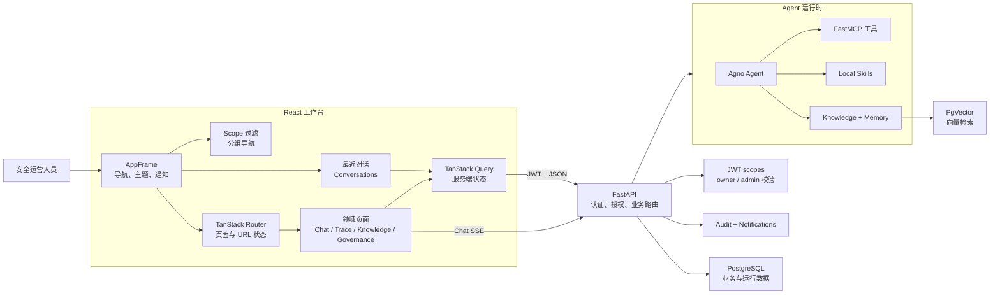
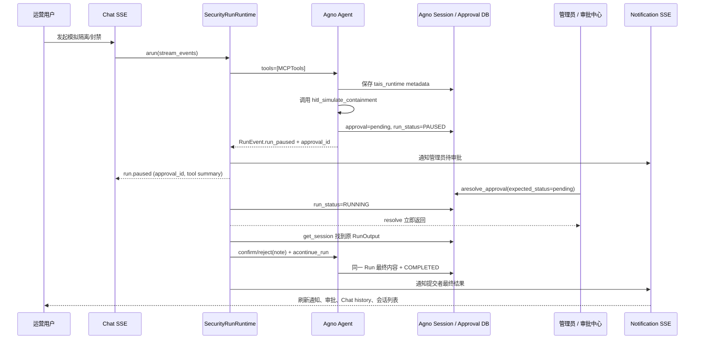

# T.A.I.S

T.A.I.S（Trinity AI Security）是一个面向安全运营的 AI 工作台。它将 Agent 对话、可观测性、MCP 工具、本地 Skills、知识库检索、CVE 情报、URL 采集、审计和访问控制收敛到一个需要认证的工作台中。

旧版 Vue + Element Plus 位于 `vue` 分支；`master` 是 React 主线。

## 技术栈

- 前端：React 19、TypeScript、Vite、TanStack Router/Query、Ant Design、Ant Design X、UnoCSS、Bun。
- 后端：FastAPI、FastAPI Users、SQLAlchemy Async、Agno、FastMCP、PostgreSQL + pgvector。
- 工具链：uv、ruff、ty、Bun、Oxlint、Oxfmt、Playwright。

## 快速开始

安装依赖：

```bash
uv sync
cd frontend && /home/shenss/.bun/bin/bun install
```

启动 API：

```bash
uv run uvicorn api.main:app --reload --host 0.0.0.0 --port 8001
```

另开终端启动前端：

```bash
cd frontend
VITE_API_PROXY_TARGET=http://127.0.0.1:8001 /home/shenss/.bun/bin/bun run dev
```

访问 [http://localhost:5173](http://localhost:5173)。

可通过以下环境变量创建初始管理员：

```bash
TAIS_BOOTSTRAP_ADMIN_EMAIL=admin@example.com
TAIS_BOOTSTRAP_ADMIN_PASSWORD=AdminPass123!
```

## 配置与运维

- 版本号以 `pyproject.toml` 的 `[project].version` 为唯一来源；API `app_version` / OpenAPI `version` 默认从已安装包元数据读取，可用 `APP_VERSION` 覆盖。发版时同步 `frontend/package.json` 的 `version`。
- 前端 i18n：侧栏语言按钮切换 `zh-CN`/`en-US`（`localStorage.locale`），页面/通知中心/Knowledge 入库文案走 feature 命名空间；日期与相对时间跟随当前语言。
- 环境变量：应用配置使用 `TAIS_*` / 领域名（`POSTGRES_*`、`AUTH_*`、`MCP_*`）；`AGNO_*` 仅用于引擎耦合（如 `AGNO_DB_SCHEMA`）。
- CVE 情报源配置为仓库根目录 `cve_sources.toml`（可用 `TAIS_CVE_SOURCE_CONFIG_PATH` 覆盖）。
Collect 按 `api/utils/url2md_utils.domain_rules` 源站爬取文章入库（`collect_articles`），页面默认从库检索。解析侧用 `resolve_domain_rule_key` 归一化 host/`www` 并安全匹配多 class 正文容器；已停用 botcrawl / The Register / securitylab.ru。同步时并发发现与抓取，并跳过已入库成功的 URL。
- `POSTGRES_*` / `POSTGRES_URL`：PostgreSQL 连接。
- `AUTH_JWT_SECRET`：JWT 密钥；生产环境必须替换默认值。
- `TAIS_BOOTSTRAP_ADMIN_EMAIL`、`TAIS_BOOTSTRAP_ADMIN_PASSWORD`：可选的初始管理员。
- `TAIS_KNOWLEDGE_*`：Knowledge chunk、search、rerank 与 PgVector 配置。
- `VITE_API_PROXY_TARGET`：前端开发代理地址。

### 模型工具调用并行度

在“系统设置 → 模型连接 → 编辑 → Advanced”中，可为每个非 DeepSeek 模型设置“并行工具调用”。该配置持久化为 `parallel_tool_calls`：

- **启用**：向模型 API 发送 `parallel_tool_calls=true`。
- **禁用**：向模型 API 发送 `parallel_tool_calls=false`；对于不支持并行工具调用的网关或模型应选择此项。
- **留空**：不发送该参数，使用模型提供商默认值。

Responses 协议通过 Agno `OpenAIResponses.parallel_tool_calls` 传递；Chat Completions 协议通过 Agno `OpenAIChat` / `OpenAILike` 的 `request_params` 传递。聊天 Run 和会话摘要使用同一模型工厂，因此该设置同时覆盖两条调用路径。

模型配置支持请求重试：`retries` / `delay_between_retries` / `exponential_backoff`（Agno 应用层，覆盖 Chat Completions 与 Responses），以及可选 `http_max_retries`（OpenAI SDK 连接层）。默认 4 次指数退避，可在设置页按模型调整。

模型供应商支持 DeepSeek / OpenAI / **xAI（Agno 官方 `xAI` 类，Chat Completions）** / OpenAI-compatible。 xAI 可配置 structured output 与 Live Search；Chat 输入区可开关联网搜索与知识库检索。 设置页模型表单仅配置连接信息（名称/供应商/Model ID/密钥/Base URL）；其余模型参数由能力画像解析（optimal → 配置 → 请求覆盖 → fallback）；xAI 不使用 `reasoning_effort`，靠推理/非推理 model id。历史 Grok 配置（`api.x.ai` 或 `model_id` 以 `grok` 开头）加载时自动迁移为 `provider=xai`，不再走 OpenAI Responses。

模型工厂把 structured output 模式存在实例私有属性 `_tais_structured_output_mode`，**不写** Agno `model.metadata`，避免 OpenAI Responses / Chat 把内部标记当作 HTTP `metadata` 发给 Grok 等不兼容网关（会 400 `Argument not supported: metadata`）。

前端生产构建：

```bash
cd frontend && /home/shenss/.bun/bin/bun run build
```

构建结果由 FastAPI 静态托管，且不依赖 AgentOS。运行时配置、CVE 缓存和上传文件默认位于 `.config/`，日志位于 `.logs/`，均不纳入 Git。更新 CVE 数据：

```bash
uv run update-cve
```

部署时还应配置生产级数据库、JWT 密钥、MCP token、模型配置和 CORS。

## 架构

React 工作台通过共享 API client 携带 token 请求 FastAPI；后端检查权限和资源归属后，按模型、MCP、Skills、Knowledge 与 Memory 配置创建 Agno 运行时。Chat 通过 SSE 返回流式输出（含模型层 `run.retrying` 重试提示）；Markdown 启用 KaTeX（`$` / `$$` / `\\[ \\]`）渲染公式；`GET /api/chat/sessions` 使用 Agno 风格 `data`/`meta`（默认 `limit=100`、硬顶 500；DB 真分页 + 归档 SQL 过滤；前端最近对话侧栏 infinite load more）。Overview 评估快照用近期样本（`sample_size`）算 pass_rate；文档数走 paged total；traces 延迟/token 最多采样 5000，但失败数与 recent_failures 走窗口 `status=ERROR` 查询；submissions 为 data/meta。Trace、Memory 和 Knowledge 等视图通过 Query 刷新读取最新数据。

Memory API 仅使用 `/api/memories`（Agno 风格 `data`/`meta`，查询参数 `search_content`，主键字段 `memory_id`）。 列表行仅认 `memory_id`/`memory`/`topics` 等 Agno 字段，不再兼容 `id`/`content`/`topic` 别名。

Trace 列表/会话 `GET /api/traces` 与 `GET /api/traces/sessions` 使用 Agno 风格 `data`/`meta`（status 走 Agno SQL 过滤；sessions 分组仍为有界扫描并可 `meta.truncated`）；list/detail 对外只暴露 Agno 风格 `duration`（由存储层 `duration_ms` 投影，不改 Agno 表结构），list 尽量附带 root `input`（页面内一次 spans 批量查询，避免 per-trace N+1）。detail 仍为工作台自研契约。 Trace 深链 query 仅使用 `session_id`/`run_id`/`selected_session`/`trace`（不再识别 `session`/`run`）；Dashboard 最近失败亦走该契约。

Approvals HITL 列表 `GET /api/approvals` 使用 Agno 风格 `data`/`meta`；详情/resolve/resume 与 Skill/MCP `submissions` 仍为工作台自研契约（身份 enrich、拒绝理由、Run 恢复）。HITL 响应仅 enrich `submitted_by`/`resolved_by` 对象（无 `*_email` 双字段）；拒绝理由写入 `resolution_data.note`（Agno 约定），请求体仍用 `rejection_reason`。 审批中心表格对 HITL 使用服务端 `page`/`limit` 真分页；上传审批 submissions 仍整表拉取后与 HITL 按「submissions 在前」虚拟合并。

`GET /api/approvals/count` 返回 Agno 风格 `{ count }`（pending HITL），供导航 badge 与 dashboard 快照复用。 Dashboard `snapshots.approvals` 提供 `{ pending, approved, rejected }`（不再输出 `pending_approvals` 别名）。

后台 Task 失败（如 Memory 抽取）经 asyncio exception handler 记入日志；overview 快照子项失败记 exception 而非静默。Knowledge 流式入库有 15 分钟超时。

列表分页 `meta` 由共用 `api/utils/pagination.pagination_meta` 生成（Memory/Trace/Approvals/Chat sessions/Evals）。

Agent Evals 的 Agno 结果读路径 `GET /api/agent-evals/agno-runs` 使用 Agno 风格 `data`/`meta`，行字段对齐 `id` + `eval_data`（保留 `passed`/`score` 投影）；suites/cases/runs/replay 与 `/failures`/`/trends` 仍为工作台自研。



- `frontend/src/app`：Provider、Router、Shell（含通知中心已读删除）与全局样式。
- `frontend/src/features`：按领域划分的页面和逻辑。
- `frontend/src/shared`：API client、认证、i18n（`shared/i18n/namespaces/*` 按 feature 拆分 zh-CN/en-US）、类型与通用 UI。
- `api/`：认证、路由、服务、MCP 运行时、任务与测试。
- `scripts/`：运维脚本。

前端使用 TanStack Router 管理路由状态、TanStack Query 管理服务端状态；Ant Design 与 Ant Design X 提供主要 UI。FastMCP 与 FastAPI 同进程运行并挂载在 `/mcp/`。应用数据由 SQLAlchemy Async 管理，Agno 运行时数据使用 `AsyncPostgresDb`，知识库使用 PgVector。

### 导航与会话外壳

- Logo 是运行概览的唯一显式入口，点击后跳转 `/dashboard`；侧栏不重复展示“运行概览”。
- 主导航按“工作台、能力与数据、运行治理、安全情报”分组，并在权限过滤后删除空分组；默认展开前两个分组。
- “智能体”始终跳转 `/chat`，用于清除已有 `session` 参数并开始空白会话；具体历史会话通过最近对话列表进入。
- 桌面侧栏展开时使用可折叠分组，收窄到 76px 后改为权限过滤后的扁平图标列表，并完全隐藏最近对话区域。
- 最近对话按今天、昨天、更早分组；桌面展开状态保存在 `tais-shell-recent-expanded`，移动端抽屉每次打开时默认收起。
- 菜单隐藏只负责体验优化，真实访问控制仍由 FastAPI 的 scope 与资源归属检查完成。

### Knowledge 入库与更新

- 浏览器上传、正文入库、路径导入与文档更新支持 SSE 四阶段进度：`上传 → 解析 → 向量化 → 清理`。
- 更新采用安全切换：新内容先写入临时 shadow ID，成功后再切换到原文档 ID；失败时保留旧文档与旧向量，避免检索空窗。
- 按文件后缀自动选择 Reader/分块策略，支持 Markdown、文本、JSON、CSV、代码、PDF、DOCX；创建/更新后保持文档 ID、可见性与当前选中状态。
- 相关实现见 `api/services/knowledge_progress.py`、`knowledge_source_service.py` 与 `frontend/src/features/knowledge/`。

### HITL 人机审批技术架构

HITL（Human-in-the-Loop）在 Agent 执行高影响工具前暂停同一个 Agno Run，由管理员批准或拒绝后继续。Agno approvals、session RunOutput、`RunRequirement` 和 `run_status` 是唯一运行状态源；应用层不再手工维护暂停/恢复状态。

当前演示工具是 MCP `hitl` namespace 下的 `hitl_simulate_containment(target, action, reason)`。它只记录模拟处置和执行审计，不修改外部系统。审批中心同时承载 Skill/MCP 上传审批，但上传审批不进入 Agno Run 恢复链路。

#### 设计原则

- **Agno 单一状态源**：审批落库使用 Agno approvals，解析使用 `aresolve_approval(..., expected_status="pending")`，恢复使用原 session RunOutput、`RunRequirement` 和 `acontinue_run()`。
- **MCP namespace 门闩**：Agent 只挂载 `MCPTools`；加载后仅对 `hitl_` 前缀的 Agno `Function` 应用 `approval(type="required")`。
- **运行配置跟随 Run**：初始 `arun()` 把版本化 `tais_runtime` 写入 Run metadata，恢复时据此重建相同模型、reasoning、Knowledge owner、Memory 和工具输出设置。
- **产品层只补工作台能力**：管理员/提交者通知、通知 SSE、身份 enrichment、Chat/Trace 最终投影、审批 UI 和拒绝理由校验。

#### 端到端时序



#### 分层组件

| 层级 | 职责 | 关键实现 |
|------|------|----------|
| 工具边界 | FastMCP `hitl` namespace 与模拟处置 | `api/mcp/tools/hitl.py` |
| Skill 提示 | 约束何时调用、如何汇报通过/拒绝 | `api/agent/skills/hitl-containment-skill/` |
| 运行时 | MCP 审批标记、Run metadata、异步继续与启动恢复 | `api/services/security_run_runtime.py` |
| 审批 API | 列表/详情/解析、拒绝理由校验、触发恢复 | `api/routes/approvals.py`、`api/services/approvals_service.py` |
| Agno 状态 | approval、session RunOutput、requirements、`run_status` | Agno `AsyncPostgresDb` |
| 通知 | 管理员/提交者通知与鉴权 SSE | `notification_service.py`、`routes/notifications.py` |
| 历史投影 | Chat 消息 / Trace 输出中的暂停与结果文案 | `chat_session_service.py`、`tracing_service.py`、`chat_run_events.py` |
| 前端 | 审批中心、拒绝弹窗、Chat 暂停态 | `frontend/src/features/approvals/*`、`frontend/src/features/chat/*` |

#### 1. 工具与 Skill 边界

`api/mcp/tools/hitl.py` 定义 `simulate_containment`，主 MCP 服务以 `namespace="hitl"` 挂载后对客户端暴露为 `hitl_simulate_containment`。Agent 工厂只传入 `tools=[mcp_tools]`，运行时在 MCP 初始化后遍历 `functions` / `async_functions`，对所有 `hitl_` 前缀 Function 应用 Agno required approval。

`MCPTools.header_provider` 在实际工具调用时注入当前 user/session/run ID；FastMCP 工具通过 HTTP headers 写 `skill.simulated_containment.executed` 审计。Skill 要求在审批前说明暂停，批准后使用真实工具结果，拒绝后完整展示管理员理由。

#### 2. 暂停路径（Pause）

1. 用户在 Chat 发消息 → `SecurityRunRuntime` 以 `stream=True, stream_events=True` 调用 `agent.arun`。
2. 初始 Run metadata 写入版本化 `tais_runtime`，保存恢复 Agent 所需配置。
3. 模型决定调用 `hitl_simulate_containment` 时，Agno 创建 `approval_type=required` 的审批记录（`pending`），给 tool execution 打上 `approval_id`，并将 Run 置为 `PAUSED`。
4. 运行时收到 `RunEvent.run_paused` 后：
   - 通过 `paused_payload` 投影 `approval_id` / `run_id` / `session_id` / `tool_name`；
   - 通知所有管理员，链接指向具体 approval；
   - 向 Chat SSE 下发 `run.paused`，前端展示等待审批态。
5. Chat 与 Trace 此时只展示暂停状态，不创建第二条 Run 或手工修改 Trace。

#### 3. 审批解析路径（Resolve）

API：`POST /api/approvals/{approval_id}/resolve`（scope：`approvals:write`）。

请求体：

- `status`: `approved` | `rejected`
- `rejection_reason`: 拒绝时必填（Pydantic 校验，最长 2000）
- 可选 `resolution_data`

服务端行为：

1. 拒绝时把理由同时写入 `resolution_data.rejection_reason`（产品 UI）与 `resolution_data.note`（Agno 约定）。
2. `resolve_approval_record` 调用 Agno 原生解析：

```python
await aresolve_approval(
    db, approval_id,
    status=status,
    resolved_by=admin_email_or_id,
    resolved_at=unix_ts,
    resolution_data={"note": reason, "rejection_reason": reason},
)
```

   - 乐观锁固定为 `expected_status="pending"`；重复解析映射为 `409 ApprovalResolveConflictError`。
3. 对 `security-operations` Agent 且具备 run/session/user ID 的审批，将 Agno `run_status` 更新为 `RUNNING`，按 approval ID 去重注册后台 continuation task，并立即返回刷新后的 approval。
4. 写入策略审计 `approvals.approved` / `approvals.rejected`。

列表与详情只 enrich 提交者/解析人身份，运行状态统一读取 Agno `run_status`。普通用户 `approvals:read` 仅可见自己的记录；解析和重试要求 `approvals:write`。

重试：`POST /api/approvals/{id}/resume` 仅接受已解析且 `run_status=ERROR` 的安全 Chat approval。

#### 4. 恢复路径（Resume，Agno Native）

`SecurityRunRuntime` 后台任务执行：

1. 按 approval 的 `session_id` / `user_id` 调用 Agno DB `get_session()`，在 session runs 中找到同一 `run_id` 的 RunOutput。
2. 从 Run metadata 的 `tais_runtime` 重建相同 Agent 配置。
3. 收集原 Run 的 active `RunRequirement`：批准调用 `confirm()`；拒绝调用 `reject(note="Rejected by administrator: ...")`。
4. 调用 `agent.acontinue_run(run_response=原 RunOutput, requirements=..., stream=True)` 并消费到终态。
5. Agno 持久化同一 Run 的最终内容并更新 approval `run_status=COMPLETED`。异常时写 `ERROR`、标记 Trace 失败并通知双方。
6. 进程启动时恢复已解析且 `run_status` 为 `PAUSED`/`RUNNING` 的任务；关闭时取消任务但保留 `RUNNING`，下次启动继续。

拒绝 note 的固定前缀保证 Chat/Skill/审计侧可稳定识别：

```text
Rejected by administrator: <管理员填写的理由>
```

#### 5. 产品层扩展（非 Agno 内置）

| 扩展 | 原因 |
|------|------|
| 版本化 `tais_runtime` metadata | 用原 Run 自身重建 Agent，不引入第二状态源 |
| approval ID 后台任务表 | 单进程内避免重复调度；重启后按 Agno `run_status` 恢复 |
| 通知中心与 SSE | 管理员待办、提交者最终结果、断线游标补发 |
| 邮箱 / 身份 enrichment | 审批列表展示提交者与审批人可读身份 |
| Chat/Trace 投影 | 以 Agno 最终 RunOutput 覆盖暂停占位或部分输出 |
| 前端拒绝必填 | UX 与 API 双重校验，保证 note 始终非空 |
| 审计事件 | `skill.simulated_containment.executed`、`approvals.*` 与策略审计对接 |

**刻意不做的事**：不手工改写 Agno session JSON、trace ID 或拼接 continuation spans。不再维护独立的 `hitl_paused_runs` 表；启动时会 `DROP TABLE IF EXISTS` 清理历史残留。

#### 6. 数据与状态

**Agno approvals（引擎库）**

- 关键字段：`id`、`run_id`、`session_id`、`status`、`approval_type`、`pause_type`、`tool_name`、`tool_args`、`user_id`、`resolution_data`、`resolved_by`、`resolved_at`、`run_status` 等。
- HITL 工具审批：`approval_type=required`，创建时 `status=pending`。
- `status` 表示审批决定（`pending` / `approved` / `rejected`）；`run_status` 表示主 Run（`PAUSED` / `RUNNING` / `COMPLETED` / `ERROR` 等）。
- Agno session 中同一 RunOutput 保存最终 assistant 内容、工具结果、requirements 和 `tais_runtime` metadata。

**Run / 工具状态（概念）**

```text
RUNNING ──hitl tool──► PAUSED ──resolve──► RUNNING ──acontinue_run──► COMPLETED
                                      └──continuation error──► ERROR ──manual retry──► RUNNING
```

#### 7. 前端体验

- **审批中心**（`/approvals`）：列表 HITL 与上传审批；展示提交者邮箱、工具名/参数和 Agno `run_status`；拒绝弹窗强制填写原因；`run_status=ERROR` 时显示「重试恢复」。
- **Chat**：SSE `run.paused` 展示等待审批；历史刷新后根据 tool `confirmed` / `confirmation_note` 显示最终结果或拒绝说明；消息可携带 `approval_id` 便于跳转审批详情。
- **通知**：`GET /api/notifications/stream?after_id=` 按 ID 游标升序推送 `notification.created`；前端使用 Authorization fetch stream，并按 1/2/5/10 秒退避重连，30 秒 REST 轮询兜底。
- **双向刷新**：暂停通知管理员并链接具体 approval；继续完成后通知提交者并链接 `/chat?session=...`；失败同时通知双方。事件会刷新通知、审批、对应 Chat history 和会话列表。
- i18n：`frontend/src/shared/i18n/namespaces/approvals.*` 与 `chat.*`。

#### 8. 权限与安全边界

- 解析 HITL / 上传审批：`approvals:write`（通常仅管理员）。
- 查看：`approvals:read`；非管理员仅自己的提交/相关记录。
- 后端是唯一授权边界；菜单隐藏不能替代 scope。
- 工具本身只做**模拟**处置并写审计；生产若接入真实处置，应保持同一 HITL 门闩，不得在未审批路径调用。

#### 9. 与「上传审批」的关系

| | Agent 工具 HITL | Skill/MCP 上传审批 |
|--|-----------------|-------------------|
| 触发 | Chat 中工具调用暂停 run | 用户提交 staging 资源 |
| 存储 | Agno approvals + session RunOutput | 应用侧 submission approvals |
| 解析 API | `POST /api/approvals/{id}/resolve` | `POST /api/approvals/submissions/{id}/resolve` |
| 通过后 | `acontinue_run` 执行工具 | 发布/启用资源 |
| 拒绝后 | 工具不执行，note 回写 run | 资源不发布，通知提交者 |

两者共享审批中心 UI 与「拒绝必填理由」交互，但运行时恢复链路仅工具 HITL 需要。

#### 10. 关键代码索引

```text
api/mcp/tools/hitl.py                     # FastMCP hitl namespace 与模拟处置
api/agent/skills/hitl-containment-skill/  # Skill 使用规范
api/services/security_run_runtime.py      # metadata、requirements、后台 continue/recovery
api/services/approvals_service.py         # aresolve_approval 与 Agno approval 查询
api/routes/approvals.py                   # 异步 resolve/retry HTTP 契约
api/routes/notifications.py               # 鉴权通知 SSE
api/services/notification_service.py      # 管理员/提交者双向通知
api/services/chat_run_events.py           # run.paused 投影
api/services/chat_session_service.py      # Agno Run 历史与拒绝理由投影
api/services/tracing_service.py           # 最终 RunOutput 覆盖 Trace 根输出
frontend/src/app/shell/AppFrame.tsx       # 通知 stream、重连和 Query 刷新
```

相关测试：`api/tests/test_hitl_containment.py`、`test_security_run_runtime.py`、`test_approvals_service.py`、`test_notifications.py`、`test_notification_service.py`、`test_chat_session_service.py`、`test_trace_permissions.py`，以及前端 approvals/notifications 测试。

官方 Agno 文档参考：<https://docs.agno.com/hitl/overview>、<https://docs.agno.com/hitl/approval>。

## 安全与审计

后端是唯一安全边界：前端的菜单隐藏、按钮禁用和路由保护只改善体验，不能作为授权依据。所有受保护 API 必须在后端检查 scope；用户资源必须校验 owner 或 admin 能力。普通用户只能修改自己的 private 资源，Guest 只能读取安全数据。

登录使用 FastAPI Users/JWT，scope 写入 JWT claims。关键变更会记录 actor、action、resource、metadata、IP 和 user-agent。管理员可通过 `GET /api/audit/logs`（需要 `audit:read`）按用户、动作、资源、状态、IP 和时间范围分页查询审计事件；当前不提供导出、实时告警或外部 SIEM 集成。

## 开发与验证

Python：

```bash
uv run ruff check .
uv run ty check .
uv run pytest api/tests
```

前端：

```bash
cd frontend && /home/shenss/.bun/bin/bun run check
# 仅 Vitest：bun run test
# 慢用例定位：bun run test:profile
```

Vitest 默认关闭 CSS 解析、限制 `maxWorkers=4`、使用 instant `user-event` 与无动画 Ant Design 主题，以降低 DOM 重型页面套件的墙钟与抖动。功能测试以业务行为、权限边界、错误处理和 API 契约为主，避免依赖源码结构、文案、CSS 类名或完整 DOM。涉及前端布局和交互时，用 Playwright 在宽屏和窄屏完成真实流程验证，截图放入 `.tmp`。

## 术语

- **Chat Session**：归属于用户的一段连续对话历史；一次执行称为 **Run**。
- **Trace / Span**：一次完整执行的可观测记录及其内部操作。
- **Skill**：可按需启用并加载到运行时的本地能力包。
- **MCP Service**：通过 MCP endpoint 暴露工具的服务；**MCP Token** 用于其访问授权。
- **Knowledge Base**：可供 Agent 检索的内部文档集合，不等同于长期 **Memory**。
- **Audit Log**：安全相关用户动作的追加式记录。
- **HITL / Approval**：人机审批门闩；Agent 工具 HITL 暂停 run 直至管理员解析，上传审批则控制 Skill/MCP 入库。详见 [HITL 人机审批技术架构](#hitl-人机审批技术架构)。
- **RunRequirement**：Agno 暂停 run 的确认/输入要求；恢复时 `confirm()` / `reject(note=...)` 后 `acontinue_run`。


## 工作流编排技术架构

> 状态：**PR1 已落地**（线性 Step 定义 CRUD + 编译 + SSE 运行）。并行 / 条件 / 循环 / 画布为后续阶段。

### 目标与原则

工作台 Workflow 不是独立调度引擎，而是把 **可持久化 DSL → Agno `Workflow` 编译 → 流式运行 → Trace / 审计** 串成闭环：

| 原则 | 说明 |
|------|------|
| 状态源 | Agno `Workflow` / `WorkflowSession` / Run 事件 |
| 工作台职责 | 定义 CRUD、校验、编译、SSE 投影、权限与审计 |
| 不做 | 全量挂载 AgentOS、前端 `eval` 用户代码、自研执行引擎 |
| 与 Chat 关系 | 共享模型工厂；PR1 步骤 **无 MCP 工具**，降低编排不确定性 |

### 端到端数据流

```text
[Workflow UI] --CRUD--> /api/workflows  --JSON DSL-->  app.workflows 表
       |                      |
       | POST .../runs        v
       +--------SSE----> compile_workflow() -> agno.workflow.Workflow
                                  |
                                  | arun(stream=True, stream_events=True)
                                  v
                         workflow.* / step.* SSE
                                  |
                    Trace(session_id, workflow_id) + audit workflow.run
```

### PR1 契约（当前实现）

**定义 DSL（仅线性 `step`）**

```json
{
  "name": "Incident triage",
  "description": "...",
  "steps": [
    {
      "id": "triage",
      "type": "step",
      "name": "Triage",
      "executor": { "kind": "agent", "ref": "security-operations" },
      "instructions": "Classify severity"
    }
  ]
}
```

- `executor.ref` 必须来自内置目录：`security-operations`、`safe-fallback`（`GET /api/workflows/executors`）。
- PR4 支持嵌套 `step` / `parallel` / `condition` / `loop` / `router` / `workflow_ref`。
- 约束：最大深度 5、总节点 ≤40、叶子 Agent 步 ≤20；Parallel 至少 2 分支；Condition/Loop 使用 CEL（`cel-python`）。
- 编译期拒绝 HITL 字段与 Parallel 内 executor HITL（与 Agno 一致）。

**HTTP**

| 方法 | 路径 | Scope | 说明 |
|------|------|-------|------|
| GET | `/api/workflows` | `workflows:read` | `{data,meta}` 列表 |
| POST | `/api/workflows` | `workflows:write` | 创建 |
| GET/PATCH/DELETE | `/api/workflows/{id}` | read / write | 详情、更新、删除（owner 隔离，admin 可跨用户） |
| GET | `/api/workflows/executors` | `workflows:read` | 可绑执行器目录 |
| GET | `/api/workflows/templates` | `workflows:read` | 内置安全模板 |
| POST | `/api/workflows/{id}/runs` | `workflows:run` | SSE 运行 |

**SSE 事件（工作台投影）**

| Event | 含义 |
|-------|------|
| `workflow.started` | 运行开始（含 `run_id` / `session_id`） |
| `step.started` / `step.completed` / `step.error` | 叶子步骤生命周期；`content` 为预览截断 |
| `parallel.started` / `parallel.completed` | 并行块生命周期（含 `parallel_step_count`） |
| `condition.started` / `condition.completed` | 条件块（含 `condition_result` / `branch`） |
| `loop.started` / `loop.completed` | 循环块（含 `max_iterations` / `total_iterations`） |
| `loop.iteration.started` / `loop.iteration.completed` | 循环迭代（含 `iteration` / `should_continue`） |
| `router.started` / `router.completed` | Router 选择分支 |
| `workflow.completed` / `workflow.failed` / `workflow.cancelled` | 终态 |
| `workflow.paused` | Step 确认暂停；携带 `approval_id`，在 Approvals 批准/拒绝后 `acontinue_run` |

**关键代码**

```text
api/persistence/workflows.py          # app.workflows 表
api/services/workflow_compiler.py     # DSL 校验 + Agno Step/Parallel/Condition/Loop 编译
api/services/workflow_service.py      # CRUD / 权限投影
api/services/workflow_run_runtime.py  # arun 流 → SSE
api/routes/workflows.py               # HTTP + EventSourceResponse
frontend/src/features/workflow/*      # 工作流画布（reparent / 快捷键 / auto-layout / Inspector / SSE）
```

### 路线图（PR2+）

| 阶段 | 能力 | 说明 |
|------|------|------|
| **PR1** ✅ | 线性 Step + Save/Run SSE | 本版 |
| **PR2** ✅ | `Parallel` / `Condition(CEL)` / `Loop` | 表单级嵌套控制流；CEL 依赖 `cel-python`；编译期禁止 Parallel 内 HITL |
| **PR3** ✅ | 画布 + Step HITL | React Flow 只读布局选中；Step `requires_confirmation` → Approvals；`workflows:read/write` |
| **P0 产品** | P0.1–P0.4 ✅ 黄金路径闭环（见 TODOs） |
| **Perf** ✅ | Studio SSE 增量 runStatus + 选中/高亮 patch + runLog 上限 |
| **Layout** ✅ | `applyAutoLayout` 像素级树打包，防 then/else 节点重叠 |
| **RF skill** ✅ | typed nodes / stable props / onlyRenderVisible / isValidConnection |
| **P0 UI** ✅ | Studio：`updateNodeData` 运行态 + antd-in-canvas（nodrag/popup） |
| **PR9** ✅ | 安全模板库 / `workflows:run` / Inspector CEL 自动完成 |
| **P0.1** ✅ | Studio 状态机：draft/published 顶栏、触发器发布守卫、空态模板 CTA |
| **P0.2** ✅ | 触发器运维：Webhook URL/curl、Cron last/next、失败通知 |
| **PR8c** ✅ | 触发器生产化：cron 原子占坑 / webhook·cron 审计 / Studio 触发历史 |
| **PR8d** ✅ | 画布性能：runStatus data patch；Inspector undo burst |
| **PR8b** ✅ | 画布打磨：保存校验 / 连线高亮 / run 聚焦 / NodeToolbar |
| **PR8a** ✅ | 多 Handle 分支边（Condition then/else · Router choices） |
| **Ports** ✅ | 几何感知 L/R vs top/bottom（`pickConnectionHandles`） |
| **Align** ✅ | 拖拽智能对齐辅助线；Chat 操作位右下角 |
| **PR7** ✅ | Publish + Cron 真调度（published 修订 / webhook·cron 只用线上版） |
| **PR6** ✅ | 画布 run 状态 / Run 历史 / Approvals↔Studio 深链 / user_input_schema 表单 |
| **PR5** ✅ | 画布 reparent / undo·redo·多选 / auto-layout / Approvals user_input·output_review 表单 |
| **PR4** ✅ | Router / 嵌套 Workflow / 版本 / 触发器 + 画布编辑 + 完整 Step HITL | 见下 |

**PR2 嵌套 DSL 示例**

```json
{
  "name": "IR nested",
  "steps": [
    {
      "id": "fanout",
      "type": "parallel",
      "name": "Fan-out",
      "steps": [
        { "id": "cve", "type": "step", "name": "CVE", "executor": { "kind": "agent", "ref": "security-operations" } },
        { "id": "asset", "type": "step", "name": "Asset", "executor": { "kind": "agent", "ref": "safe-fallback" } }
      ]
    },
    {
      "id": "branch",
      "type": "condition",
      "name": "Severity",
      "evaluator": { "cel": "input.contains(\"critical\")" },
      "then": [
        { "id": "contain", "type": "step", "name": "Contain", "executor": { "kind": "agent", "ref": "security-operations" } }
      ],
      "else": [
        { "id": "report", "type": "step", "name": "Report", "executor": { "kind": "agent", "ref": "safe-fallback" } }
      ]
    },
    {
      "id": "retry",
      "type": "loop",
      "name": "Retry",
      "max_iterations": 3,
      "end_condition": { "cel": "last_step_content.contains(\"DONE\")" },
      "steps": [
        { "id": "probe", "type": "step", "name": "Probe", "executor": { "kind": "agent", "ref": "safe-fallback" } }
      ]
    }
  ]
}
```

后端编译为 Agno `Step` / `Parallel` / `Condition` / `Loop`；前端为表单级嵌套编辑（非画布）。

### 设计决策（已拍板 / 默认）

1. **Executor 来源（PR1）**：内置 Agent 注册表，不手填任意 Python。  
2. **MCP/Skills**：步骤默认无 MCP 工具；**P0.3** Step 可绑定已启用 Skill（`skills[]` = 启用 ∩ 绑定；未绑定则不挂）。  
3. **画布（PR1–PR2）**：不做；列表 + 嵌套 Inspector；React Flow 在 PR3。  
4. **Session**：每次 Run 新 `session_id`，与 Chat session 隔离；UI 可跳转 Trace。  
5. **权限（PR3/PR9）**：`workflows:read` / `write` / `run`；菜单用 read；Run 用 run；编辑用 write。

### 明确不做

- 继续只生成不可执行伪代码当作「编排完成」  
- 前端直接执行用户代码  
- 绕过 Agno 自研 step runner  
- 首期并行 + 深度嵌套 + 画布一把做完  


## 当前计划

已完成工作、下一阶段优先级、风险与验收标准见 [TODOs.md](./TODOs.md)。
