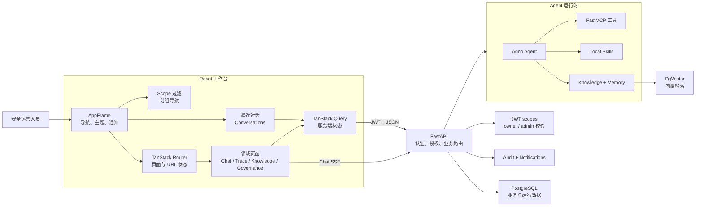
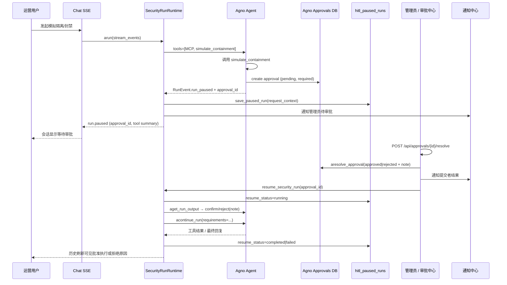

# T.A.I.S

T.A.I.S（Trinity AI Security）是一个面向安全运营的 AI 工作台。它将 Agent 对话、可观测性、MCP 工具、本地 Skills、知识库检索、CVE 情报、URL 采集、审计和访问控制收敛到一个需要认证的工作台中。

旧版 Vue + Element Plus 位于 `vue` 分支；`master` 是 React 主线。

## 技术栈

- 前端：React 19、TypeScript、Vite、TanStack Router/Query、Ant Design、Ant Design X、UnoCSS、Bun。
- 后端：FastAPI、FastAPI Users、SQLAlchemy Async、Agno、FastMCP、PostgreSQL + pgvector。
- 工具链：uv、ruff、ty、Bun、Oxlint、Oxfmt、Playwright。

## 快速开始

安装依赖：

```bash
uv sync
cd frontend && /home/shenss/.bun/bin/bun install
```

启动 API：

```bash
uv run uvicorn api.main:app --reload --host 0.0.0.0 --port 8001
```

另开终端启动前端：

```bash
cd frontend
VITE_API_PROXY_TARGET=http://127.0.0.1:8001 /home/shenss/.bun/bin/bun run dev
```

访问 [http://localhost:5173](http://localhost:5173)。

可通过以下环境变量创建初始管理员：

```bash
TAIS_BOOTSTRAP_ADMIN_EMAIL=admin@example.com
TAIS_BOOTSTRAP_ADMIN_PASSWORD=AdminPass123!
```

## 配置与运维

- 版本号以 `pyproject.toml` 的 `[project].version` 为唯一来源；API `app_version` / OpenAPI `version` 默认从已安装包元数据读取，可用 `APP_VERSION` 覆盖。发版时同步 `frontend/package.json` 的 `version`。
- 前端 i18n：侧栏语言按钮切换 `zh-CN`/`en-US`（`localStorage.locale`），页面/通知中心/Knowledge 入库文案走 feature 命名空间；日期与相对时间跟随当前语言。
- 环境变量：应用配置使用 `TAIS_*` / 领域名（`POSTGRES_*`、`AUTH_*`、`MCP_*`）；`AGNO_*` 仅用于引擎耦合（如 `AGNO_DB_SCHEMA`）。
- CVE 情报源配置为仓库根目录 `cve_sources.toml`（可用 `TAIS_CVE_SOURCE_CONFIG_PATH` 覆盖）。
- `POSTGRES_*` / `POSTGRES_URL`：PostgreSQL 连接。
- `AUTH_JWT_SECRET`：JWT 密钥；生产环境必须替换默认值。
- `TAIS_BOOTSTRAP_ADMIN_EMAIL`、`TAIS_BOOTSTRAP_ADMIN_PASSWORD`：可选的初始管理员。
- `TAIS_KNOWLEDGE_*`：Knowledge chunk、search、rerank 与 PgVector 配置。
- `VITE_API_PROXY_TARGET`：前端开发代理地址。

前端生产构建：

```bash
cd frontend && /home/shenss/.bun/bin/bun run build
```

构建结果由 FastAPI 静态托管，且不依赖 AgentOS。运行时配置、CVE 缓存和上传文件默认位于 `.config/`，日志位于 `.logs/`，均不纳入 Git。更新 CVE 数据：

```bash
uv run update-cve
```

部署时还应配置生产级数据库、JWT 密钥、MCP token、模型配置和 CORS。

## 架构

React 工作台通过共享 API client 携带 token 请求 FastAPI；后端检查权限和资源归属后，按模型、MCP、Skills、Knowledge 与 Memory 配置创建 Agno 运行时。Chat 通过 SSE 返回流式输出，Trace、Memory 和 Knowledge 等视图通过 Query 刷新读取最新数据。



- `frontend/src/app`：Provider、Router、Shell（含通知中心已读删除）与全局样式。
- `frontend/src/features`：按领域划分的页面和逻辑。
- `frontend/src/shared`：API client、认证、i18n（`shared/i18n/namespaces/*` 按 feature 拆分 zh-CN/en-US）、类型与通用 UI。
- `api/`：认证、路由、服务、MCP 运行时、任务与测试。
- `scripts/`：运维脚本。

前端使用 TanStack Router 管理路由状态、TanStack Query 管理服务端状态；Ant Design 与 Ant Design X 提供主要 UI。FastMCP 与 FastAPI 同进程运行并挂载在 `/mcp/`。应用数据由 SQLAlchemy Async 管理，Agno 运行时数据使用 `AsyncPostgresDb`，知识库使用 PgVector。

### 导航与会话外壳

- Logo 是运行概览的唯一显式入口，点击后跳转 `/dashboard`；侧栏不重复展示“运行概览”。
- 主导航按“工作台、能力与数据、运行治理、安全情报”分组，并在权限过滤后删除空分组；默认展开前两个分组。
- “智能体”始终跳转 `/chat`，用于清除已有 `session` 参数并开始空白会话；具体历史会话通过最近对话列表进入。
- 桌面侧栏展开时使用可折叠分组，收窄到 76px 后改为权限过滤后的扁平图标列表，并完全隐藏最近对话区域。
- 最近对话按今天、昨天、更早分组；桌面展开状态保存在 `tais-shell-recent-expanded`，移动端抽屉每次打开时默认收起。
- 菜单隐藏只负责体验优化，真实访问控制仍由 FastAPI 的 scope 与资源归属检查完成。

### Knowledge 入库与更新

- 浏览器上传、正文入库、路径导入与文档更新支持 SSE 四阶段进度：`上传 → 解析 → 向量化 → 清理`。
- 更新采用安全切换：新内容先写入临时 shadow ID，成功后再切换到原文档 ID；失败时保留旧文档与旧向量，避免检索空窗。
- 按文件后缀自动选择 Reader/分块策略，支持 Markdown、文本、JSON、CSV、代码、PDF、DOCX；创建/更新后保持文档 ID、可见性与当前选中状态。
- 相关实现见 `api/services/knowledge_progress.py`、`knowledge_source_service.py` 与 `frontend/src/features/knowledge/`。

### HITL 人机审批技术架构

HITL（Human-in-the-Loop）用于在 Agent 执行**高影响工具**前强制暂停，由具备审批权限的管理员确认或拒绝后再继续运行。当前产品以模拟处置工具 `simulate_containment` 验证整条安全边界：真实外部系统不会被变更，但审批、恢复、通知、聊天/Trace 投影与审计路径与生产处置一致。

审批中心还承载另一类**资源入库审批**（Skill / MCP 上传 staging）。下文先说明 **Agent 工具 HITL**（Agno native pause/continue），再补充与上传审批的差异。

#### 设计原则

- **优先 Agno 原生 API**：工具暂停用 `@approval(type="required")` + `@tool(requires_confirmation=True)`；审批落库用 Agno `AsyncPostgresDb` approvals 表；解析用 `agno.run.approval.aresolve_approval`；恢复用 `RunRequirement.confirm()` / `reject(note=...)` + `agent.acontinue_run(...)`。
- **产品层只补 Agno 没有的能力**：进程重启后的可恢复上下文（`hitl_paused_runs`）、管理员/提交者通知、提交者邮箱 enrichment、Chat/Trace 历史中的暂停占位与拒绝原因投影、前端审批中心与拒绝必填理由。
- **拒绝原因必须进工具结果**：纯 `@approval` 路径上，`continue_run` 只会把 `confirmed=False` 写回工具，**不会**把 `resolution_data.note` 复制到 `confirmation_note`。因此恢复时必须走 `requirement.reject(note=...)`，才能让 Agent / 会话历史看到「Rejected by administrator: …」。

#### 端到端时序



#### 分层组件

| 层级 | 职责 | 关键实现 |
|------|------|----------|
| 工具边界 | 声明必须审批的模拟处置 | `api/services/hitl_containment.py` |
| Skill 提示 | 约束何时调用、如何汇报通过/拒绝 | `api/agent/skills/hitl-containment-skill/` |
| 运行时 | 挂载工具、流式事件、暂停持久化、原生恢复 | `api/services/security_run_runtime.py` |
| 审批 API | 列表/详情/解析、拒绝理由校验、触发恢复 | `api/routes/approvals.py`、`api/services/approvals_service.py` |
| Agno 审批存储 | pending/approved/rejected 与 `resolution_data` | Agno `AsyncPostgresDb` approvals |
| 可恢复上下文 | 审批 ID ↔ run/session/user/request | `api/persistence/hitl_runs.py`（表 `hitl_paused_runs`） |
| 通知 | 管理员待办、提交者结果 | `api/services/notification_service.py` |
| 历史投影 | Chat 消息 / Trace 输出中的暂停与结果文案 | `chat_session_service.py`、`tracing_service.py`、`chat_run_events.py` |
| 前端 | 审批中心、拒绝弹窗、Chat 暂停态 | `frontend/src/features/approvals/*`、`frontend/src/features/chat/*` |

#### 1. 工具与 Skill 边界

`simulate_containment` 使用双装饰器，同时打开 Agno 的 **required approval** 与 **confirmation** 门闩：

```python
@approval(type="required")
@tool(requires_confirmation=True)
async def simulate_containment(target, action, reason, run_context=None) -> dict:
    # 仅在审批通过并 continue 后真正执行
    # 写审计事件 skill.simulated_containment.executed，返回 status=simulated
```

- Agent 工厂在 `SecurityRunRuntime._build_security_agent` 中固定挂载：`tools=[mcp_tools, simulate_containment]`，并加载已启用的本地 Skills（含 `hitl-containment-skill`）。
- Skill 要求：用户明确请求模拟隔离/封禁时才调用；工具返回前不得声称已生效；拒绝时必须完整转述管理员原因；禁止对接真实外部处置系统。

#### 2. 暂停路径（Pause）

1. 用户在 Chat 发消息 → `SecurityRunRuntime` 以 `stream=True, stream_events=True` 调用 `agent.arun`。
2. 模型决定调用 `simulate_containment` 时，Agno 创建 `approval_type=required` 的审批记录（`pending`），给 tool execution 打上 `approval_id`，并将 run 置为 **PAUSED**。
3. 运行时收到 `RunEvent.run_paused` 后：
   - 通过 `paused_payload` 投影 `approval_id` / `run_id` / `session_id` / `tool_name` / 参数摘要；
   - `save_paused_run` 写入 `hitl_paused_runs`（含 `request_context`：消息、模型、memory 开关、知识归属等），`resume_status=pending`；
   - `notify_admins_of_hitl_approval` 推送管理员通知（跳转 `/approvals?approval_id=...`）；
   - 向 Chat SSE 下发 `run.paused`，前端展示等待审批态。
4. 聊天历史 / Trace 在 status 为 paused 且确认工具仍未 resolved 时，投影为「等待管理员审批」类占位，避免把过期助手草稿当成最终结论。

#### 3. 审批解析路径（Resolve）

API：`POST /api/approvals/{approval_id}/resolve`（scope：`approvals:write`）。

请求体：

- `status`: `approved` | `rejected`
- `rejection_reason`: 拒绝时必填（Pydantic 校验，最长 2000）
- 可选 `resolution_data`

服务端行为：

1. 拒绝时把理由同时写入 `resolution_data.rejection_reason`（产品 UI）与 `resolution_data.note`（Agno 约定）。
2. `resolve_approval_record` 先 `get_approval`（404），再调用原生：

```python
await aresolve_approval(
    db, approval_id,
    status=status,
    resolved_by=admin_email_or_id,
    resolved_at=unix_ts,
    resolution_data={"note": reason, "rejection_reason": reason},
)
```

   - 乐观锁：`expected_status="pending"`；非 pending 映射为 `409 ApprovalResolveConflictError`。
3. 对 `tool_name == simulate_containment` 的 HITL 记录：
   - 通知提交者（通过/拒绝 + 理由）；
   - 调用 `resume_security_run(approval_id)` 恢复 run；
   - 返回体附带 `resume_status`（`completed` / `failed` / 等）。
4. 写入策略审计 `approvals.approved` / `approvals.rejected`。

列表与详情会 enrichment：提交者/解析人邮箱、`resume_status` / `resume_error`（来自 `hitl_paused_runs`）。普通用户 `approvals:read` 仅可见自己相关记录；解析控件仍要求 `approvals:write`（管理员）。

#### 4. 恢复路径（Resume，Agno Native）

`SecurityRunRuntime.resume`：

1. 从 `hitl_paused_runs` 读取上下文；若 `resume_status == running` 则拒绝并发恢复。
2. 用 `request_context` 重建 `SecurityRunRequest` 与 Agent（同一 user/session/run）。
3. `apply_native_hitl_resolution`：
   - 读已解析的 approval；
   - `agent.aget_run_output(run_id, session_id, user_id)` 取暂停 run；
   - 收集 `RunRequirement`（必要时从 tools 重建）；
   - 匹配 `approval_id`（回退匹配 `simulate_containment`）；
   - **approved** → `req.confirm()`；**rejected** → `req.reject(note="Rejected by administrator: {reason}")`。
4. `agent.acontinue_run(run_id=..., session_id=..., requirements=..., stream=True)` 消费剩余事件；若 requirements 为空则退回纯 approval 路径（`acontinue_run` 无 requirements，由 Agno 按 DB 状态应用 confirmed）。
5. 更新 `resume_status` 为 `completed` 或 `failed`（错误截断写入 `resume_error`）。

拒绝 note 的固定前缀保证 Chat/Skill/审计侧可稳定识别：

```text
Rejected by administrator: <管理员填写的理由>
```

#### 5. 产品层扩展（非 Agno 内置）

| 扩展 | 原因 |
|------|------|
| 表 `hitl_paused_runs` | Agno 保存 session/run，但不保存本产品重建 Agent 所需的请求上下文；进程重启后仍需可 resume |
| 通知中心 | 管理员待办、提交者结果；Agno 不提供多用户工作台通知 |
| 邮箱 / 身份 enrichment | 审批列表展示提交者与审批人可读身份 |
| Chat/Trace 投影 | 暂停占位、拒绝后合成说明、批准后工具结果摘要；避免会话里只剩空/过期 assistant 文本 |
| 前端拒绝必填 | UX 与 API 双重校验，保证 note 始终非空 |
| 审计事件 | `skill.simulated_containment.executed`、`approvals.*` 与策略审计对接 |

**刻意不做的事**：不再手工改写 Agno session JSON 以「盖戳」拒绝说明；拒绝语义以 `RunRequirement.reject(note=...)` 与工具结果为准。

#### 6. 数据与状态

**Agno approvals（引擎库）**

- 关键字段：`id`、`run_id`、`session_id`、`status`、`approval_type`、`pause_type`、`tool_name`、`tool_args`、`user_id`、`resolution_data`、`resolved_by`、`resolved_at`、`run_status` 等。
- HITL 工具审批：`approval_type=required`，创建时 `status=pending`。

**`{AGNO_APP_SCHEMA}.hitl_paused_runs`（应用库）**

| 列 | 含义 |
|----|------|
| `approval_id` PK | 关联 Agno approval |
| `run_id` / `session_id` / `user_id` | 恢复身份 |
| `request_context` JSONB | 重建 `SecurityRunRequest` |
| `resume_status` | `pending` → `running` → `completed` \| `failed` |
| `resume_error` | 失败摘要 |

**Run / 工具状态（概念）**

```text
running ──tool(requires_confirmation + approval required)──► paused
paused  ──admin approve──► continue ──► tool executed (status=simulated) ──► completed
paused  ──admin reject + note──► continue ──► tool rejected (confirmation_note) ──► completed
```

#### 7. 前端体验

- **审批中心**（`/approvals`）：列表 HITL 与上传审批；展示提交者邮箱、工具名/参数、resume 状态；管理员通过/拒绝；拒绝弹窗强制填写原因。
- **Chat**：SSE `run.paused` 展示等待审批；历史刷新后根据 tool `confirmed` / `confirmation_note` 显示最终结果或拒绝说明；消息可携带 `approval_id` 便于跳转审批详情。
- **通知**：管理员「待 HITL 审批」；提交者「已通过 / 已拒绝 + 理由」；`data.path` 指向审批页。
- i18n：`frontend/src/shared/i18n/namespaces/approvals.*` 与 `chat.*`。

#### 8. 权限与安全边界

- 解析 HITL / 上传审批：`approvals:write`（通常仅管理员）。
- 查看：`approvals:read`；非管理员仅自己的提交/相关记录。
- 后端是唯一授权边界；菜单隐藏不能替代 scope。
- 工具本身只做**模拟**处置并写审计；生产若接入真实处置，应保持同一 HITL 门闩，不得在未审批路径调用。

#### 9. 与「上传审批」的关系

| | Agent 工具 HITL | Skill/MCP 上传审批 |
|--|-----------------|-------------------|
| 触发 | Chat 中工具调用暂停 run | 用户提交 staging 资源 |
| 存储 | Agno approvals + `hitl_paused_runs` | 应用侧 submission approvals |
| 解析 API | `POST /api/approvals/{id}/resolve` | `POST /api/approvals/submissions/{id}/resolve` |
| 通过后 | `acontinue_run` 执行工具 | 发布/启用资源 |
| 拒绝后 | 工具不执行，note 回写 run | 资源不发布，通知提交者 |

两者共享审批中心 UI 与「拒绝必填理由」交互，但运行时恢复链路仅工具 HITL 需要。

#### 10. 关键代码索引

```text
api/services/hitl_containment.py          # simulate_containment 原生装饰器
api/agent/skills/hitl-containment-skill/  # Skill 使用规范
api/services/security_run_runtime.py      # pause 持久化 + apply_native_hitl_resolution + resume
api/persistence/hitl_runs.py              # hitl_paused_runs
api/services/approvals_service.py         # aresolve_approval 封装、列表 enrichment
api/routes/approvals.py                   # HTTP 契约、通知与 resume 编排
api/services/notification_service.py      # 管理员/提交者通知
api/services/chat_run_events.py           # run.paused 投影
api/services/chat_session_service.py      # 历史 HITL 文案
api/services/tracing_service.py           # Trace HITL 文案
frontend/src/features/approvals/          # 审批中心
frontend/src/features/chat/               # 暂停态与结果展示
```

相关测试：`api/tests/test_approvals_service.py`、`test_hitl_containment.py`、`test_security_run_runtime.py`（native resolve）、`test_notification_service.py`，以及前端 `ApprovalsPage.test.tsx` / chat utils 测试。

官方 Agno 文档参考：<https://docs.agno.com/hitl/overview>、<https://docs.agno.com/hitl/approval>。

## 安全与审计

后端是唯一安全边界：前端的菜单隐藏、按钮禁用和路由保护只改善体验，不能作为授权依据。所有受保护 API 必须在后端检查 scope；用户资源必须校验 owner 或 admin 能力。普通用户只能修改自己的 private 资源，Guest 只能读取安全数据。

登录使用 FastAPI Users/JWT，scope 写入 JWT claims。关键变更会记录 actor、action、resource、metadata、IP 和 user-agent。管理员可通过 `GET /api/audit/logs`（需要 `audit:read`）按用户、动作、资源、状态、IP 和时间范围分页查询审计事件；当前不提供导出、实时告警或外部 SIEM 集成。

## 开发与验证

Python：

```bash
uv run ruff check .
uv run ty check .
uv run pytest api/tests
```

前端：

```bash
cd frontend && /home/shenss/.bun/bin/bun run check
# 仅 Vitest：bun run test
# 慢用例定位：bun run test:profile
```

Vitest 默认关闭 CSS 解析、限制 `maxWorkers=4`、使用 instant `user-event` 与无动画 Ant Design 主题，以降低 DOM 重型页面套件的墙钟与抖动。功能测试以业务行为、权限边界、错误处理和 API 契约为主，避免依赖源码结构、文案、CSS 类名或完整 DOM。涉及前端布局和交互时，用 Playwright 在宽屏和窄屏完成真实流程验证，截图放入 `.tmp`。

## 术语

- **Chat Session**：归属于用户的一段连续对话历史；一次执行称为 **Run**。
- **Trace / Span**：一次完整执行的可观测记录及其内部操作。
- **Skill**：可按需启用并加载到运行时的本地能力包。
- **MCP Service**：通过 MCP endpoint 暴露工具的服务；**MCP Token** 用于其访问授权。
- **Knowledge Base**：可供 Agent 检索的内部文档集合，不等同于长期 **Memory**。
- **Audit Log**：安全相关用户动作的追加式记录。
- **HITL / Approval**：人机审批门闩；Agent 工具 HITL 暂停 run 直至管理员解析，上传审批则控制 Skill/MCP 入库。详见 [HITL 人机审批技术架构](#hitl-人机审批技术架构)。
- **RunRequirement**：Agno 暂停 run 的确认/输入要求；恢复时 `confirm()` / `reject(note=...)` 后 `acontinue_run`。

## 当前计划

已完成工作、下一阶段优先级、风险与验收标准见 [TODOs.md](./TODOs.md)。
