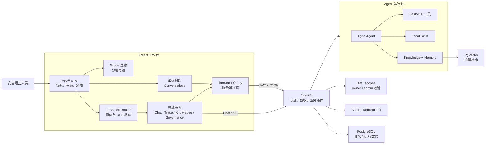

# T.A.I.S

T.A.I.S（Trinity AI Security）是一个面向安全运营的 AI 工作台。它将 Agent 对话、可观测性、MCP 工具、本地 Skills、知识库检索、CVE 情报、URL 采集、审计和访问控制收敛到一个需要认证的工作台中。

旧版 Vue + Element Plus 位于 `vue` 分支；`master` 是 React 主线。

## 技术栈

- 前端：React 19、TypeScript、Vite、TanStack Router/Query、Ant Design、Ant Design X、UnoCSS、Bun。
- 后端：FastAPI、FastAPI Users、SQLAlchemy Async、Agno、FastMCP、PostgreSQL + pgvector。
- 工具链：uv、ruff、ty、Bun、Oxlint、Oxfmt、Playwright。

## 快速开始

安装依赖：

```bash
uv sync
cd frontend && /home/shenss/.bun/bin/bun install
```

启动 API：

```bash
uv run uvicorn api.main:app --reload --host 0.0.0.0 --port 8001
```

另开终端启动前端：

```bash
cd frontend
VITE_API_PROXY_TARGET=http://127.0.0.1:8001 /home/shenss/.bun/bin/bun run dev
```

访问 [http://localhost:5173](http://localhost:5173)。

可通过以下环境变量创建初始管理员：

```bash
TAIS_BOOTSTRAP_ADMIN_EMAIL=admin@example.com
TAIS_BOOTSTRAP_ADMIN_PASSWORD=AdminPass123!
```

## 配置与运维

- 版本号以 `pyproject.toml` 的 `[project].version` 为唯一来源；API `app_version` / OpenAPI `version` 默认从已安装包元数据读取，可用 `APP_VERSION` 覆盖。发版时同步 `frontend/package.json` 的 `version`。
- 前端 i18n：侧栏语言按钮切换 `zh-CN`/`en-US`（`localStorage.locale`），页面文案走 feature 命名空间；日期格式跟随当前语言。
- 环境变量：应用配置使用 `TAIS_*` / 领域名（`POSTGRES_*`、`AUTH_*`、`MCP_*`）；`AGNO_*` 仅用于引擎耦合（如 `AGNO_DB_SCHEMA`）。
- CVE 情报源配置为仓库根目录 `cve_sources.toml`（可用 `TAIS_CVE_SOURCE_CONFIG_PATH` 覆盖）。
- `POSTGRES_*` / `POSTGRES_URL`：PostgreSQL 连接。
- `AUTH_JWT_SECRET`：JWT 密钥；生产环境必须替换默认值。
- `TAIS_BOOTSTRAP_ADMIN_EMAIL`、`TAIS_BOOTSTRAP_ADMIN_PASSWORD`：可选的初始管理员。
- `TAIS_KNOWLEDGE_*`：Knowledge chunk、search、rerank 与 PgVector 配置。
- `VITE_API_PROXY_TARGET`：前端开发代理地址。

前端生产构建：

```bash
cd frontend && /home/shenss/.bun/bin/bun run build
```

构建结果由 FastAPI 静态托管，且不依赖 AgentOS。运行时配置、CVE 缓存和上传文件默认位于 `.config/`，日志位于 `.logs/`，均不纳入 Git。更新 CVE 数据：

```bash
uv run update-cve
```

部署时还应配置生产级数据库、JWT 密钥、MCP token、模型配置和 CORS。

## 架构

React 工作台通过共享 API client 携带 token 请求 FastAPI；后端检查权限和资源归属后，按模型、MCP、Skills、Knowledge 与 Memory 配置创建 Agno 运行时。Chat 通过 SSE 返回流式输出，Trace、Memory 和 Knowledge 等视图通过 Query 刷新读取最新数据。



- `frontend/src/app`：Provider、Router、Shell 与全局样式。
- `frontend/src/features`：按领域划分的页面和逻辑。
- `frontend/src/shared`：API client、认证、i18n（`shared/i18n/namespaces/*` 按 feature 拆分 zh-CN/en-US）、类型与通用 UI。
- `api/`：认证、路由、服务、MCP 运行时、任务与测试。
- `scripts/`：运维脚本。

前端使用 TanStack Router 管理路由状态、TanStack Query 管理服务端状态；Ant Design 与 Ant Design X 提供主要 UI。FastMCP 与 FastAPI 同进程运行并挂载在 `/mcp/`。应用数据由 SQLAlchemy Async 管理，Agno 运行时数据使用 `AsyncPostgresDb`，知识库使用 PgVector。

### 导航与会话外壳

- Logo 是运行概览的唯一显式入口，点击后跳转 `/dashboard`；侧栏不重复展示“运行概览”。
- 主导航按“工作台、能力与数据、运行治理、安全情报”分组，并在权限过滤后删除空分组；默认展开前两个分组。
- “智能体”始终跳转 `/chat`，用于清除已有 `session` 参数并开始空白会话；具体历史会话通过最近对话列表进入。
- 桌面侧栏展开时使用可折叠分组，收窄到 76px 后改为权限过滤后的扁平图标列表，并完全隐藏最近对话区域。
- 最近对话按今天、昨天、更早分组；桌面展开状态保存在 `tais-shell-recent-expanded`，移动端抽屉每次打开时默认收起。
- 菜单隐藏只负责体验优化，真实访问控制仍由 FastAPI 的 scope 与资源归属检查完成。

### Knowledge 入库与更新

- 浏览器上传、正文入库、路径导入与文档更新支持 SSE 四阶段进度：`上传 → 解析 → 向量化 → 清理`。
- 更新采用安全切换：新内容先写入临时 shadow ID，成功后再切换到原文档 ID；失败时保留旧文档与旧向量，避免检索空窗。
- 按文件后缀自动选择 Reader/分块策略，支持 Markdown、文本、JSON、CSV、代码、PDF、DOCX；创建/更新后保持文档 ID、可见性与当前选中状态。
- 相关实现见 `api/services/knowledge_progress.py`、`knowledge_source_service.py` 与 `frontend/src/features/knowledge/`。

## 安全与审计

后端是唯一安全边界：前端的菜单隐藏、按钮禁用和路由保护只改善体验，不能作为授权依据。所有受保护 API 必须在后端检查 scope；用户资源必须校验 owner 或 admin 能力。普通用户只能修改自己的 private 资源，Guest 只能读取安全数据。

登录使用 FastAPI Users/JWT，scope 写入 JWT claims。关键变更会记录 actor、action、resource、metadata、IP 和 user-agent。管理员可通过 `GET /api/audit/logs`（需要 `audit:read`）按用户、动作、资源、状态、IP 和时间范围分页查询审计事件；当前不提供导出、实时告警或外部 SIEM 集成。

## 开发与验证

Python：

```bash
uv run ruff check .
uv run ty check .
uv run pytest api/tests
```

前端：

```bash
cd frontend && /home/shenss/.bun/bin/bun run check
# 仅 Vitest：bun run test
# 慢用例定位：bun run test:profile
```

Vitest 默认关闭 CSS 解析、限制 `maxWorkers=4`、使用 instant `user-event` 与无动画 Ant Design 主题，以降低 DOM 重型页面套件的墙钟与抖动。功能测试以业务行为、权限边界、错误处理和 API 契约为主，避免依赖源码结构、文案、CSS 类名或完整 DOM。涉及前端布局和交互时，用 Playwright 在宽屏和窄屏完成真实流程验证，截图放入 `.tmp`。

## 术语

- **Chat Session**：归属于用户的一段连续对话历史；一次执行称为 **Run**。
- **Trace / Span**：一次完整执行的可观测记录及其内部操作。
- **Skill**：可按需启用并加载到运行时的本地能力包。
- **MCP Service**：通过 MCP endpoint 暴露工具的服务；**MCP Token** 用于其访问授权。
- **Knowledge Base**：可供 Agent 检索的内部文档集合，不等同于长期 **Memory**。
- **Audit Log**：安全相关用户动作的追加式记录。

## 当前计划

已完成工作、下一阶段优先级、风险与验收标准见 [TODOs.md](./TODOs.md)。
