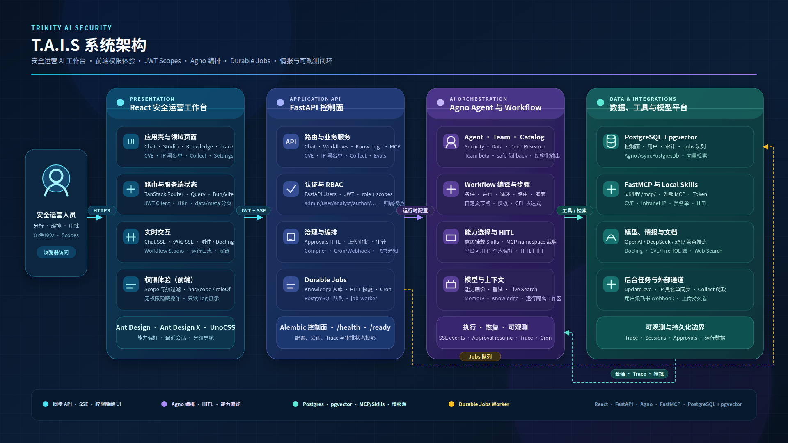

# T.A.I.S

T.A.I.S（Trinity AI Security）是一个面向安全运营的 AI 工作台。它将 Agent 对话、可观测性、MCP 工具、本地 Skills、知识库检索、CVE 情报、URL 采集、审计和访问控制收敛到一个需要认证的工作台中。

旧版 Vue + Element Plus 位于 `vue` 分支；`master` 是 React 主线。

本地 GPU：默认从 PyTorch **cu124** 索引安装 `torch`/`torchvision`（适配 GTX 1070 Ti 等 Pascal，驱动 CUDA ≥12.x）。Knowledge/Chat 的 Docling 依赖该栈。

更细的技术文档见 [`docs/`](./docs/README.md)（架构、HITL、工作流、运维、开发门禁等；关键链路附 **Mermaid** 图例）。

## 内置 Agents

Chat 与 Workflow 共用稳定 `agent_id` / executor `ref`（见 `api/services/agent_catalog.py`）：

| id | 名称 | 默认能力 |
|----|------|----------|
| `security-operations` | 安全运营助手 | MCP + Local Skills + HITL + Knowledge |
| `data-analysis` | 数据分析助手 | Calculator + 每运行隔离的 File/CSV 工作区 + 可选只读 **SQLTools**（`TAIS_DATA_SQL_URL`）+ Knowledge 口径 + Reasoning；本地 Python 仅限显式开发开关 |
| `deep-research` | 深度研究助手 | Reasoning + Website + Web Search（`ddgs`，优先 api/html backend）；Knowledge / Live Search；可审计 Markdown 备忘录 |
| `safe-fallback` | 轻量分析助手 | 无工具（Workflow 兜底） |

Chat 可按 `agent_id` 选择助手；Skills/MCP 偏好与 Team beta、Data/Deep Research 对齐、`0700` 运行隔离与 `TAIS_ALLOW_UNSAFE_LOCAL_PYTHON` 等细节见 [内置 Agents 与 Agno 对齐](./docs/agents.md)。Workflow Studio 与步骤绑定见 [工作流编排](./docs/workflows.md)。

## 技术栈

- 前端：React 19、TypeScript、Vite、TanStack Router/Query、Ant Design、Ant Design X、UnoCSS、Bun。
- 后端：FastAPI、FastAPI Users、SQLAlchemy Async、Agno、FastMCP、PostgreSQL + pgvector。
- 工具链：uv、ruff、ty、Bun、Oxlint、Oxfmt、Playwright。

## 快速开始

安装依赖：

```bash
uv sync
cd frontend && bun install
```

启动 API：

```bash
uv run uvicorn api.main:app --reload --host 0.0.0.0 --port 8001
```

另开终端启动 durable job worker（Knowledge、HITL、cron、Memory 与 Eval Suite 异步运行均需要）：

```bash
uv run job-worker --concurrency 4
```

另开终端启动前端：

```bash
cd frontend
bun run dev
```

访问 [http://localhost:5173](http://localhost:5173)。
开发代理默认连接 `http://127.0.0.1:8001`；仅在 API 运行于其他地址时设置
`VITE_API_PROXY_TARGET`。

可通过以下环境变量创建初始管理员：

```bash
TAIS_BOOTSTRAP_ADMIN_EMAIL=admin@example.com
TAIS_BOOTSTRAP_ADMIN_PASSWORD=AdminPass123!
```

产品角色仅保留：`admin` / `user`。管理员在设置页「用户管理」分配；`user` 覆盖日常工作台操作，`admin` 保留系统级控制。JWT 含 `role`+`scopes`+账户授权版本；改角色会立即使目标账户的旧 token 失效。升级时 Alembic 会将历史专属角色归并为 `user`。

控制面表结构由 Alembic 管理：发布前执行 `uv run alembic upgrade head`。环境变量、Jobs Worker、模型策略与生产校验见 [配置与运维](./docs/operations.md)。

CVE 库更新支持 GitHub PoC/Exp 与 Exploit-DB 数据源；管理员可在设置页的「CVE 数据源」中分别启用或停用。停用源不会删除既有 CVE 数据或缓存。

## 架构

React 工作台通过共享 API client 携带 JWT 请求 FastAPI；后端校验权限与资源归属后，按模型、MCP、Skills、Knowledge 与 Memory 创建 Agno 运行时。Chat 走 SSE；长期记忆使用廉价 MemoryManager，可配置是否记忆工具内容、注入侧打分截断，并由 durable job 按年龄 + Top-k 自动 prune。Workflow Studio 负责定义编译与流式运行；HITL 与上传审批汇入审批中心。



可编辑源文件：[docs/assets/tais-architecture.svg](./docs/assets/tais-architecture.svg)。分层说明、仓库布局、导航外壳与 Knowledge 入库见 [系统架构](./docs/architecture.md)。

| 主题 | 文档 |
|------|------|
| 内置 Agents · Team · Data/Deep Research | [docs/agents.md](./docs/agents.md) |
| HITL 暂停 / 恢复 / 审批中心 | [docs/hitl.md](./docs/hitl.md) |
| 工作流 DSL · 编译 · Studio | [docs/workflows.md](./docs/workflows.md) |
| 配置、Alembic、Jobs、模型 | [docs/operations.md](./docs/operations.md) |
| JWT scopes 与审计 | [docs/security.md](./docs/security.md) |
| 安全防护评估 · 数据集分层与 Pack 生命周期 | [docs/safety-eval.md](./docs/safety-eval.md) |
| 安全评估 pack 拉取与缓存 | [eval_packs/README.md](./eval_packs/README.md) · `scripts/eval_packs/fetch_pack.py` |
| 测试与门禁 | [docs/development.md](./docs/development.md) |
| 术语 | [docs/glossary.md](./docs/glossary.md) |

## 开发速览

```bash
# 后端
uv run ruff check .
uv run ty check .
uv run pytest api/tests

# 前端
cd frontend && bun run check
# e2e：bun run test:e2e
```

完整约定见 [开发与验证](./docs/development.md)。

## 当前计划

已完成工作、下一阶段优先级、风险与验收标准见 [TODOs.md](./TODOs.md)。
