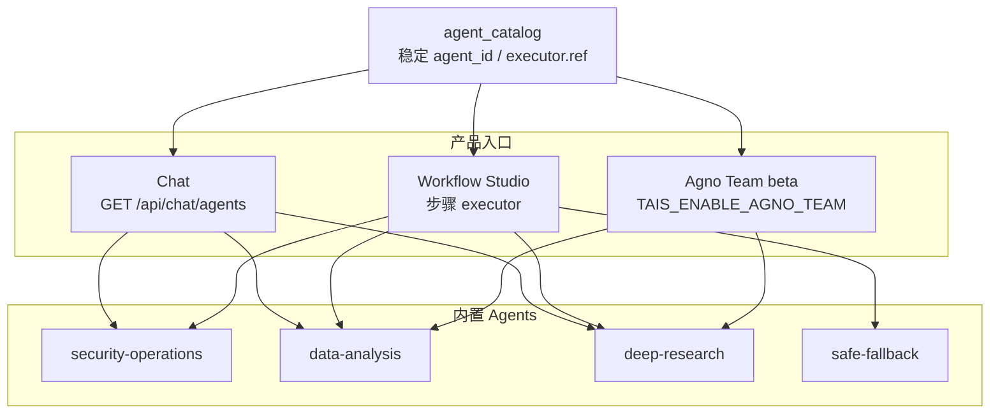

# 内置 Agents 与 Agno 对齐

Chat 与 Workflow 共用稳定 `agent_id` / executor `ref`（见 `api/services/agent_catalog.py`）。产品入口见仓库根 [README.md](../README.md#内置-agents)。

## Catalog

| id | 名称 | 默认能力 |
|----|------|----------|
| `security-operations` | 安全运营助手 | MCP + Local Skills + HITL + Knowledge |
| `data-analysis` | 数据分析助手 | Calculator + 每运行隔离的 File/CSV 工作区 + 可选只读 **SQLTools**（`TAIS_DATA_SQL_URL`）+ Knowledge 口径 + Reasoning；本地 Python 仅限显式开发开关 |
| `deep-research` | 深度研究助手 | Reasoning + Website + Web Search（`ddgs`，优先 api/html backend）；Knowledge / Live Search；可审计 Markdown 备忘录 |
| `safe-fallback` | 轻量分析助手 | 无工具（Workflow 兜底） |

Catalog 与工作台入口的关系：

## 工作台集成

- Chat：`GET /api/chat/agents`，发消息可带 `agent_id`（multipart/JSON）。
- Workflow Studio（三栏：左侧节点/模板/工作流 Tab · 页面视图网格 · 右侧属性/运行 Tab · 顶栏纯图标工具条）：步骤 executor 下拉同步 catalog；左侧「基础 / 业务 / 自定义」节点预设可拖放或双击添加；步骤可「保存为自定义节点」（按用户隔离）。编排契约见 [工作流编排](./workflows.md)。
- Skills / MCP：列表「启用」为用户级偏好（稀疏：缺省启用）；管理员另见平台可用开关。运行时与 Workflow 步骤绑定仅加载「平台可用 ∩ 个人有效」的能力；`GET /api/me/capabilities` 提供偏好读写。
- **Agno Team（beta）**：`TAIS_ENABLE_AGNO_TEAM=1` 时 Chat 可选 `research-analysis-team`（coordinate）/ `research-analysis-route` / `research-analysis-broadcast` / `research-analysis-tasks`；Tasks 模式遵循 Agno 的 `TaskStateUpdated` 快照渲染实时任务看板（负责人、依赖、结果与完成状态），并支持独立任务并行、依赖任务串行汇总。成员事件映射为 ThoughtChain，队长内容为最终回答；成员与 Team 的原始工具 I/O 默认不持久化。历史 Team 会话在 Team 关闭或移除时 fail-closed，不会降级到普通 Agent；默认不启用以避免 HITL/MCP 语义混淆。

## Agno 对齐（Data / Deep Research）

- Workflow 模板：`deep-research-review`（scope → parallel 调研/分析 → memo）、`csv-quick-analysis`（profile → metrics → readout）。

- **Data analysis**：遵循 [Data Agents](https://docs.agno.com/use-cases/data-agents/overview) — 先 introspect 后查询、答案附查询/步骤、Knowledge 承载业务口径、写边界靠只读 **SQLTools** 连接（`TAIS_DATA_SQL_URL`）；本地 CSV 用 Polars/File，不引入 DuckDB。
- **分析运行隔离**：Chat、Team、Workflow（含审批恢复）各自创建并在结束时删除 `0700` 临时工作区；上传文件只会 stage 到当前运行。File/CsvTools 绑定该目录。目录边界不是 Python 进程沙箱：生产环境始终不挂载本地 `PythonTools`；可信的非生产开发环境才可显式设置 `TAIS_ALLOW_UNSAFE_LOCAL_PYTHON=1`，生产执行应接入真实容器/VM 沙箱。
- **Deep research**：遵循 [Deep Research](https://docs.agno.com/use-cases/deep-research/overview) — grounding、结构化可审计交付、多源对照。
- **Team beta**：route / coordinate / broadcast / tasks 对应官方 orchestration patterns；标准化流水线继续用 Workflow Studio。
