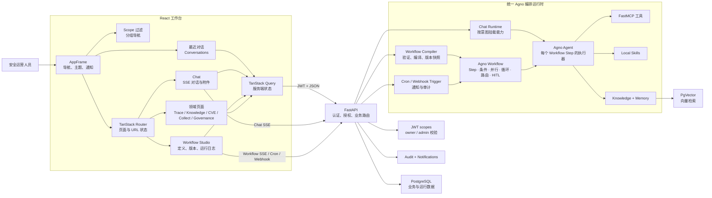

# 系统架构

React 工作台通过 JWT 调用 FastAPI；后端按模型、MCP、Skills、Knowledge 与 Memory 创建 Agno 运行时。下图为当前栈的分层总览（与 README 一致）。

## 架构图

源文件：[tais-architecture.svg](./assets/tais-architecture.svg)

## 运行时与数据流

React 工作台通过共享 API client 携带 token 请求 FastAPI；后端检查权限和资源归属后，按模型、MCP、Skills、Knowledge 与 Memory 配置创建 Agno 运行时。Chat 基座提示词仅描述边界与已装 skill 路由，Skills 走 progressive discovery（不把完整 SKILL.md 预注入）；飞书 Webhook 等密钥留在 MCP 服务端，不经 `add_dependencies_to_context` 写入模型上下文。Workflow 步骤 `user_input` 支持结构化 `user_input_schema`（str/text/number/bool）；审批中心按类型渲染表单。工作流会话在最近对话中前缀 `[WF]`Trace 对含 `workflow_id` 的会话可一键打开 Studio。Studio 支持 Ctrl/⌘S 保存并 toast 成功反馈（保存后保留当前选中节点；运行中有未保存草稿时顶栏提示；运行中锁定画布结构与定义字段，并隐藏节点工具栏/空槽 CTA、禁用调色板双击加节点（仍可保存/停止））；脏草稿或运行中切换库/模板/重置前确认（运行中先停）；多选粘贴追加到画布根级并 Toast 提示；空剪贴板粘贴/非法 reparent 有反馈；运行中 Esc/停止会 abort SSE 并调用服务端 `workflow.run.cancel`，Run Log 立即记「已由用户停止」；服务端取消非 404 失败时顶栏可关闭提示；最近运行摘要不展示原始 SSE 事件名；Studio 保存、运行与发布前校验工作流名称/定义；保存要求工作流名称非空；update/publish 时后端拒绝 `workflow_ref` 指向自身（与前端 `self_workflow_ref` 对齐）。；有 `workflow_id` 时打开 Studio，否则打开 Trace。Chat 输入区可开关本轮 MCP/Skills（`enable_tools`，关则轻量提示词且不连 MCP）；开启时按消息意图挂载 Local Skills（trivial 不挂，关键词匹配部分 skill，通用安全任务全量）；trivial 不连 MCP，关键词 skill 同步裁剪内置 MCP 命名空间（保留 basic + 匹配前缀）；`run.started` 下发 `enable_tools` / `lean_mode` / `skill_names`：手动关工具、意图自动轻量、部分/全量 Skills 分徽标；历史从 `metadata.tais_runtime` 投影。联网搜索与知识库检索可独立开关。Chat 通过 SSE 返回流式输出；支持 Ant Design X `Attachments` 附件（`multipart` `files` → Agno Image/File/Audio/Video）（含模型层 `run.retrying` 重试提示；生成中 Esc / 停止按钮可取消（含重试退避；Modal/Drawer 打开时 Esc 不误停）；切换会话会取消进行中的 run 并清空流式态以便加载历史；智能体页内嵌对话列表（Ant Design X Conversations；不挂载流式 useChat）；应用内离开 Chat 仅断开 SSE，服务端 detached worker + live hub 继续生成，切回经 GET /chat/sessions/{id}/live（可选 `last_event_index` 增量 catch-up，对齐 AgentOS `/resume`）重连；显式 Stop 走 `acancel_run`；同 session 重新生成/新 turn 会 supersede 先前 worker；关页/刷新在流式时浏览器提示）；Markdown 启用 KaTeX（`$` / `$$` / `\\[ \\]`）渲染公式；`GET /api/chat/sessions` 使用 Agno 风格 `data`/`meta`；深链标题/类型用 `GET /api/chat/sessions/{id}/meta`（与列表同形投影；404 为会话不存在，网络/5xx 可重试且不误当 agent 历史；meta 解析中禁用发送，workflow 会话不走 agent 发送；meta/workflow 跳转期间显示会话加载占位）（默认客户端 `limit=40`、接口硬顶 500；DB 真分页；`include_archived` / `archived_only` SQL 过滤；智能体页对话列表单页最近会话（无加载更多）；Trace 归档 Tab 用 `archived_only` 有界窗）。Overview 评估快照用近期样本（`sample_size`）算 pass_rate；文档数走 paged total；Knowledge 列表前端受控服务端分页；检索试验台与结果卡片文案 i18n（默认 12）；traces 延迟 p50/p95 与 series 优先 SQL 全窗聚合，token 最多采样 50（不做 status reconcile）；失败数走窗口 `status=ERROR` 计数；failed_runs/failure_rate 为窗口原生 ERROR 计数；recent_failures 为 ERROR 列表 + chat-audit 补充（有界），Dashboard 标明口径；run_id 批量补 trace 走 `trace_lookup_service.batch_traces_by_run_ids`。；submissions 为 data/meta。Trace、Memory 和 Knowledge 等视图通过 Query 刷新读取最新数据。 Agent Eval 的 suite/case **run 历史**列表 `GET /api/agent-evals/suites/{id}/runs` 与 `.../cases/{id}/runs` 使用 Agno 风格 `data`/`meta`（`page`/`limit`，默认 50、上限 100）。Knowledge 检索 `POST /api/knowledge/search` 与 Eval `GET /api/agent-evals/failures` 同样为 `data`/`meta`（无旧 `results`/裸数组兼容）。Workflow 触发历史 `GET /api/workflows/{id}/triggers/history` 使用标准 `pagination_meta`（`total_count`，非 `total`）。 Workflow 列表客户端保留 `data`/`meta`（默认 limit=100）；深链按 ID `GET /api/workflows/{id}`；Studio 打开中 loading，Run 日志完成输出支持 Markdown；Run 日志事件类型 i18n；运行/触发历史状态 i18n；保存校验失败自动聚焦无效节点并滚动到 Inspector 对应字段；Run 开始时自动展开运行日志。对话列表支持标题/预览/ID 搜索（服务端 `q` + 分页，空结果保留搜索框）；Chat 流式输出贴底滚动去抖；横幅错误可关闭。Workflow 库可搜索（服务端 `q`）并支持加载更多（无限分页），Run 日志自动滚动；Chat「回到最新」随输入区高度定位。 Approvals 工作台列表客户端以 `{data, meta}` 消费；`kind=all` 走 `GET /api/approvals?combined=true` 服务端合并分页（uploads 优先再 HITL）。 Memory 列表与 Eval `agno-runs` 客户端亦返回 `{data, meta}`。CVE / 通知 / Collect / Knowledge search / Approvals 列表解析统一走 `frontend/src/shared/lib/pagination.normalizePaginatedList`（含通知 `unread_count` extras）。 Audit 日志、Workflow 列表解析与 Eval failures 亦同路径。 Skills / MCP / Eval catalog 与 Workflow executors·versions·templates 列表客户端一并收口；Chat/Memory/Approvals meta 类型别名共享。 Trace 列表/会话客户端同形；`/traces/sessions` 默认服务端 `page`/`limit`（归档筛选有界窗口）。

Memory API 仅使用 `/api/memories`（Agno 风格 `data`/`meta`，查询参数 `search_content`，主键字段 `memory_id`）。 列表行仅认 `memory_id`/`memory`/`topics` 等 Agno 字段，不再兼容 `id`/`content`/`topic` 别名。

Trace 列表/会话 `GET /api/traces` 与 `GET /api/traces/sessions` 使用 Agno 风格 `data`/`meta`（status 走 Agno SQL 过滤；sessions 通过 SQL 按 `session_id` 聚合分页；仅 Trace 列表在状态 reconciliation 收窄当前页时以 `meta.truncated` 标注近似总数）；list/detail 对外只暴露 Agno 风格 `duration`（由存储层 `duration_ms` 投影，不改 Agno 表结构），list 尽量附带 root `input`（页面内一次 spans 批量查询，避免 per-trace N+1）。detail 仍为工作台自研契约。 Trace 深链 query 仅使用 `session_id`/`run_id`/`selected_session`/`trace`（不再识别 `session`/`run`）；Dashboard 最近失败亦走该契约。

Approvals HITL 列表 `GET /api/approvals` 使用 Agno 风格 `data`/`meta`；详情/resolve/resume 与 Skill/MCP `submissions` 仍为工作台自研契约（身份 enrich、拒绝理由、Run 恢复）。HITL 响应仅 enrich `submitted_by`/`resolved_by` 对象（无 `*_email` 双字段）；拒绝理由写入 `resolution_data.note`（Agno 约定），请求体仍用 `rejection_reason`。 审批中心表格对 HITL 与上传审批 submissions 均走服务端 `page`/`limit`；`kind=all` 时按「submissions 在前」虚拟合并两路分页结果。Audit `GET /api/audit/logs` 同样使用 `data`/`meta`。 CVE `POST /api/cve/search` 与 Collect `POST /api/url2md/articles/search`（及 sources）亦同。 Knowledge `GET /api/knowledge` 列表行为 `data`/`meta`（`meta.ingest_defaults` 只提供入库表单默认值；不暴露进度或运行状态）。 Skills `GET /api/skills` 与 Notifications `GET /api/notifications`（`meta.unread_count`）亦同。 Agent Eval suites/cases 与 MCP components/tokens 列表亦同。

`GET /api/approvals/count` 返回 Agno 风格 `{ count }`（pending HITL），供导航 badge 与 dashboard 快照复用。 Dashboard `snapshots.approvals` 提供 `{ pending, approved, rejected }`（不再输出 `pending_approvals` 别名）。

后台 Task 失败（如 Memory 抽取）经 asyncio exception handler 记入日志；overview 快照子项失败记 exception 而非静默。Knowledge 后台入库 Task 统一 15 分钟超时。

列表分页 `meta` 由共用 `api/utils/pagination.pagination_meta` 生成（Memory/Trace/Approvals/Chat sessions/Evals）；TypedDict `PaginationMeta` 供 Memory/Approvals 等服务层复用。前端 Knowledge 文档列表亦走 `normalizePaginatedList`。

Agent Evals 的 Agno 结果读路径 `GET /api/agent-evals/agno-runs` 使用 Agno 风格 `data`/`meta`，行字段对齐 `id` + `eval_data`（保留 `passed`/`score` 投影）；前端 Runs 表按 `page`/`limit` 受控分页；Failures `GET /failures` 为 `data`/`meta`（默认取近期 50 条）；suites/cases/runs/replay 仍为工作台自研。

- `frontend/src/app`：Provider、Router、Shell（含通知中心已读删除）与全局样式。
- `frontend/src/features`：按领域划分的页面和逻辑。
- `frontend/src/shared`：API client、认证、i18n（`shared/i18n/namespaces/*` 按 feature 拆分 zh-CN/en-US）、类型与通用 UI。
- `api/`：认证、路由、服务、MCP 运行时、任务与测试。
- `scripts/`：运维脚本。

前端使用 TanStack Router 管理路由状态、TanStack Query 管理服务端状态；Ant Design 与 Ant Design X 提供主要 UI。FastMCP 与 FastAPI 同进程运行并挂载在 `/mcp/`。应用数据由 SQLAlchemy Async 管理，Agno 运行时数据使用 `AsyncPostgresDb`，知识库使用 PgVector。

## 导航与会话外壳

- 深链进入治理/情报页时，侧栏自动展开目标路由所属分组（不持久化 openKeys；默认仍展开前两组）。

- Logo 是运行概览的唯一显式入口，点击后跳转 `/dashboard`；侧栏不重复展示“运行概览”。
- 主导航按“工作台、能力与数据、运行治理、安全情报”分组，并在权限过滤后删除空分组；默认展开前两个分组。
- “智能体”始终跳转 `/chat`，用于清除已有 `session` 参数并开始空白会话；具体历史会话通过最近对话列表进入。
- 桌面侧栏展开时使用可折叠分组，收窄到 76px 后改为权限过滤后的扁平图标列表，并完全隐藏最近对话区域。
- 最近对话按今天、昨天、更早分组；桌面展开状态保存在 `tais-shell-recent-expanded`，移动端抽屉每次打开时默认收起。
- 菜单隐藏只负责体验优化，真实访问控制仍由 FastAPI 的 scope 与资源归属检查完成。

## Knowledge 入库与更新

- **Drawer UX**：文件接受/落盘后立即返回 `status=processing` 占位；**解析与向量化在后台 Task** 执行，Drawer 不阻塞。失败经 `notify_background_task_failure` 通知；前端不轮询，用户可按需刷新列表获取完成行。
- 更新采用安全切换：新内容先写入临时 shadow ID，成功后再切换到原文档 ID；失败时保留旧文档与旧向量，避免检索空窗。
- 按文件后缀自动选择 Reader/分块策略，支持 Markdown、文本、JSON、CSV、代码、PDF、DOCX（Docling）。
- 相关实现见 `api/routes/knowledge.py`（`_schedule_knowledge_ingest`）与 `frontend/src/features/knowledge/`。入库路径为后台 Task，直接绑定当前 ASGI event loop；前端不维护进度 SSE 状态，也无 job 轮询 API。

