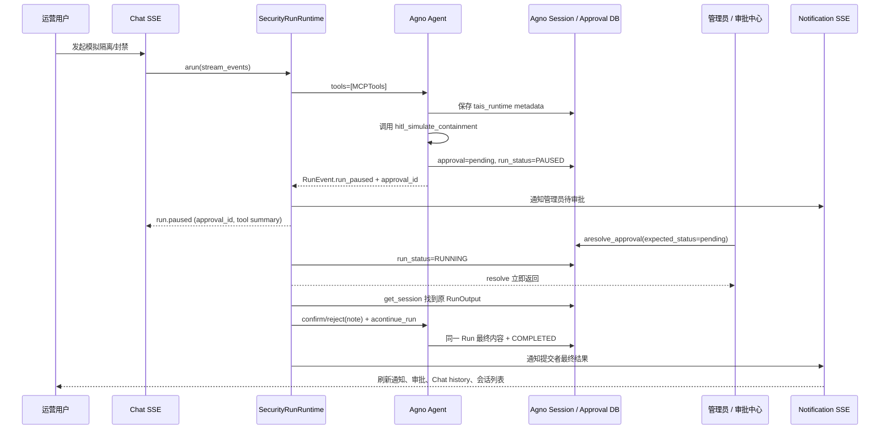
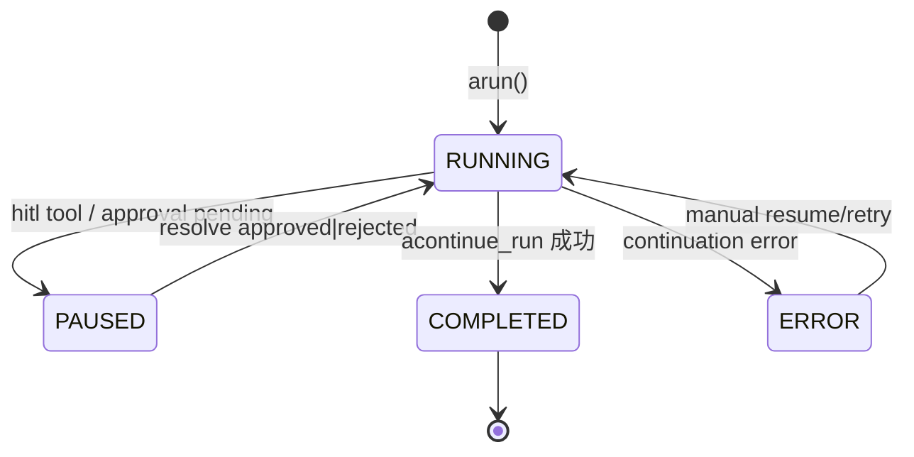

# HITL 人机审批技术架构

HITL（Human-in-the-Loop）在 Agent 执行高影响工具前暂停同一个 Agno Run，由管理员批准或拒绝后继续。Agno approvals、session RunOutput、`RunRequirement` 和 `run_status` 是唯一运行状态源；应用层不再手工维护暂停/恢复状态。

当前演示工具是 MCP `hitl` namespace 下的 `hitl_simulate_containment(target, action, reason)`。它只记录模拟处置和执行审计，不修改外部系统。审批中心同时承载 Skill/MCP 上传审批，但上传审批不进入 Agno Run 恢复链路。

## 设计原则

- **Agno 单一状态源**：审批落库使用 Agno approvals，解析使用 `aresolve_approval(..., expected_status="pending")`，恢复使用原 session RunOutput、`RunRequirement` 和 `acontinue_run()`。
- **MCP namespace 门闩**：Agent 只挂载 `MCPTools`；加载后仅对 `hitl_` 前缀的 Agno `Function` 应用 `approval(type="required")`。
- **运行配置跟随 Run**：初始 `arun()` 把版本化 `tais_runtime` 写入 Run metadata，恢复时据此重建相同模型、reasoning、Knowledge owner、Memory 和工具输出设置。
- **产品层只补工作台能力**：管理员/提交者通知、通知 SSE、身份 enrichment、Chat/Trace 最终投影、审批 UI 和拒绝理由校验。

## 端到端时序



## 分层组件

| 层级 | 职责 | 关键实现 |
|------|------|----------|
| 工具边界 | FastMCP `hitl` namespace 与模拟处置 | `api/mcp/tools/hitl.py` |
| Skill 提示 | 约束何时调用、如何汇报通过/拒绝 | `api/agent/skills/hitl-containment-skill/` |
| 运行时 | MCP 审批标记、Run metadata、异步继续与启动恢复 | `api/services/security_run_runtime.py` |
| 审批 API | 列表/详情/解析、拒绝理由校验、触发恢复 | `api/routes/approvals.py`、`api/services/approvals_service.py` |
| Agno 状态 | approval、session RunOutput、requirements、`run_status` | Agno `AsyncPostgresDb` |
| 通知 | 管理员/提交者通知与鉴权 SSE | `notification_service.py`、`routes/notifications.py` |
| 历史投影 | Chat 消息 / Trace 输出中的暂停与结果文案 | `chat_session_service.py`、`tracing_service.py`、`chat_run_events.py` |
| 前端 | 审批中心、拒绝弹窗、Chat 暂停态 | `frontend/src/features/approvals/*`、`frontend/src/features/chat/*` |

## 1. 工具与 Skill 边界

`api/mcp/tools/hitl.py` 定义 `simulate_containment`，主 MCP 服务以 `namespace="hitl"` 挂载后对客户端暴露为 `hitl_simulate_containment`。Agent 工厂只传入 `tools=[mcp_tools]`，运行时在 MCP 初始化后遍历 `functions` / `async_functions`，对所有 `hitl_` 前缀 Function 应用 Agno required approval。

`MCPTools.header_provider` 在实际工具调用时注入当前 user/session/run ID；FastMCP 工具通过 HTTP headers 写 `skill.simulated_containment.executed` 审计。Skill 要求在审批前说明暂停，批准后使用真实工具结果，拒绝后完整展示管理员理由。

## 2. 暂停路径（Pause）

1. 用户在 Chat 发消息 → `SecurityRunRuntime` 以 `stream=True, stream_events=True` 调用 `agent.arun`。
2. 初始 Run metadata 写入版本化 `tais_runtime`，保存恢复 Agent 所需配置。
3. 模型决定调用 `hitl_simulate_containment` 时，Agno 创建 `approval_type=required` 的审批记录（`pending`），给 tool execution 打上 `approval_id`，并将 Run 置为 `PAUSED`。
4. 运行时收到 `RunEvent.run_paused` 后：
   - 通过 `paused_payload` 投影 `approval_id` / `run_id` / `session_id` / `tool_name`；
   - 通知所有管理员，链接指向具体 approval；
   - 向 Chat SSE 下发 `run.paused`，前端展示等待审批态。
5. Chat 与 Trace 此时只展示暂停状态，不创建第二条 Run 或手工修改 Trace。

## 3. 审批解析路径（Resolve）

API：`POST /api/approvals/{approval_id}/resolve`（scope：`approvals:write`）。

请求体：

- `status`: `approved` | `rejected`
- `rejection_reason`: 拒绝时必填（Pydantic 校验，最长 2000）
- 可选 `resolution_data`

服务端行为：

1. 拒绝时把理由同时写入 `resolution_data.rejection_reason`（产品 UI）与 `resolution_data.note`（Agno 约定）。
2. `resolve_approval_record` 调用 Agno 原生解析：

```python
await aresolve_approval(
    db, approval_id,
    status=status,
    resolved_by=admin_email_or_id,
    resolved_at=unix_ts,
    resolution_data={"note": reason, "rejection_reason": reason},
)
```

   - 乐观锁固定为 `expected_status="pending"`；重复解析映射为 `409 ApprovalResolveConflictError`。
3. 对 `security-operations` Agent 且具备 run/session/user ID 的审批，将 Agno `run_status` 更新为 `RUNNING`，按 approval ID 去重注册后台 continuation task，并立即返回刷新后的 approval。
4. 写入策略审计 `approvals.approved` / `approvals.rejected`。

列表与详情只 enrich 提交者/解析人身份，运行状态统一读取 Agno `run_status`。普通用户 `approvals:read` 仅可见自己的记录；解析和重试要求 `approvals:write`。

重试：`POST /api/approvals/{id}/resume` 仅接受已解析且 `run_status=ERROR` 的安全 Chat approval。

## 4. 恢复路径（Resume，Agno Native）

`SecurityRunRuntime` 后台任务执行：

1. 按 approval 的 `session_id` / `user_id` 调用 Agno DB `get_session()`，在 session runs 中找到同一 `run_id` 的 RunOutput。
2. 从 Run metadata 的 `tais_runtime` 重建相同 Agent 配置。
3. 收集原 Run 的 active `RunRequirement`：批准调用 `confirm()`；拒绝调用 `reject(note="Rejected by administrator: ...")`。
4. 调用 `agent.acontinue_run(run_response=原 RunOutput, requirements=..., stream=True)` 并消费到终态。
5. Agno 持久化同一 Run 的最终内容并更新 approval `run_status=COMPLETED`。异常时写 `ERROR`、标记 Trace 失败并通知双方。
6. 进程启动时恢复已解析且 `run_status` 为 `PAUSED`/`RUNNING` 的任务；关闭时取消任务但保留 `RUNNING`，下次启动继续。

拒绝 note 的固定前缀保证 Chat/Skill/审计侧可稳定识别：

```text
Rejected by administrator: <管理员填写的理由>
```

## 5. 产品层扩展（非 Agno 内置）

| 扩展 | 原因 |
|------|------|
| 版本化 `tais_runtime` metadata | 用原 Run 自身重建 Agent，不引入第二状态源 |
| approval ID 后台任务表 | 单进程内避免重复调度；重启后按 Agno `run_status` 恢复 |
| 通知中心与 SSE | 管理员待办、提交者最终结果、断线游标补发 |
| 邮箱 / 身份 enrichment | 审批列表展示提交者与审批人可读身份 |
| Chat/Trace 投影 | 以 Agno 最终 RunOutput 覆盖暂停占位或部分输出 |
| 前端拒绝必填 | UX 与 API 双重校验，保证 note 始终非空 |
| 审计事件 | `skill.simulated_containment.executed`、`approvals.*` 与策略审计对接 |

**刻意不做的事**：不手工改写 Agno session JSON、trace ID 或拼接 continuation spans。不再维护独立的 `hitl_paused_runs` 表；历史残留不参与运行时，可由数据库运维按需清理。

## 6. 数据与状态

**Agno approvals（引擎库）**

- 关键字段：`id`、`run_id`、`session_id`、`status`、`approval_type`、`pause_type`、`tool_name`、`tool_args`、`user_id`、`resolution_data`、`resolved_by`、`resolved_at`、`run_status` 等。
- HITL 工具审批：`approval_type=required`，创建时 `status=pending`。
- `status` 表示审批决定（`pending` / `approved` / `rejected`）；`run_status` 表示主 Run（`PAUSED` / `RUNNING` / `COMPLETED` / `ERROR` 等）。
- Agno session 中同一 RunOutput 保存最终 assistant 内容、工具结果、requirements 和 `tais_runtime` metadata。

**Run / 工具状态（概念）**



## 7. 前端体验

- **审批中心**（`/approvals`）：列表 HITL 与上传审批；展示提交者邮箱、工具名/参数和 Agno `run_status`；拒绝弹窗强制填写原因；`run_status=ERROR` 时显示「重试恢复」。
- **Chat**：SSE `run.paused` 展示等待审批；历史刷新后根据 tool `confirmed` / `confirmation_note` 显示最终结果或拒绝说明；消息可携带 `approval_id` 便于跳转审批详情。
- **通知**：`GET /api/notifications` 返回最近通知（默认 100、上限 200）与全量 `unread_count`；`GET /api/notifications/stream?after_id=` 按 ID 游标升序推送 `notification.created`；前端使用 Authorization fetch stream，并按 1/2/5/10 秒退避重连，30 秒 REST 轮询兜底。
- **双向刷新**：暂停通知管理员并链接具体 approval；继续完成后通知提交者并链接 `/chat?session=...`；失败同时通知双方。事件会刷新通知、审批、对应 Chat history 和会话列表。
- i18n：`frontend/src/shared/i18n/namespaces/approvals.*` 与 `chat.*`。

## 8. 权限与安全边界

- 解析 HITL / 上传审批：`approvals:write`（通常仅管理员）。
- 查看：`approvals:read`；非管理员仅自己的提交/相关记录。
- 后端是唯一授权边界；菜单隐藏不能替代 scope。
- 工具本身只做**模拟**处置并写审计；生产若接入真实处置，应保持同一 HITL 门闩，不得在未审批路径调用。

## 9. 与「上传审批」的关系

| | Agent 工具 HITL | Skill/MCP 上传审批 |
|--|-----------------|-------------------|
| 触发 | Chat 中工具调用暂停 run | 用户提交 staging 资源 |
| 存储 | Agno approvals + session RunOutput | 应用侧 submission approvals |
| 解析 API | `POST /api/approvals/{id}/resolve` | `POST /api/approvals/submissions/{id}/resolve` |
| 通过后 | `acontinue_run` 执行工具 | 发布/启用资源 |
| 拒绝后 | 工具不执行，note 回写 run | 资源不发布，通知提交者 |

两者共享审批中心 UI 与「拒绝必填理由」交互，但运行时恢复链路仅工具 HITL 需要。

## 10. 关键代码索引

```text
api/mcp/tools/hitl.py                     # FastMCP hitl namespace 与模拟处置
api/agent/skills/hitl-containment-skill/  # Skill 使用规范
api/services/security_run_runtime.py      # metadata、requirements、后台 continue/recovery
api/services/approvals_service.py         # aresolve_approval 与 Agno approval 查询
api/routes/approvals.py                   # 异步 resolve/retry HTTP 契约
api/routes/notifications.py               # 鉴权通知 SSE
api/services/notification_service.py      # 管理员/提交者双向通知
api/services/chat_run_events.py           # run.paused 投影
api/services/chat_session_service.py      # Agno Run 历史与拒绝理由投影
api/services/tracing_service.py           # 最终 RunOutput 覆盖 Trace 根输出
frontend/src/app/shell/AppFrame.tsx       # 通知 stream、重连和 Query 刷新
```

相关测试：`api/tests/test_hitl_containment.py`、`test_security_run_runtime.py`、`test_approvals_service.py`、`test_notifications.py`、`test_notification_service.py`、`test_chat_session_service.py`、`test_trace_permissions.py`，以及前端 approvals/notifications 测试。

官方 Agno 文档参考：<https://docs.agno.com/hitl/overview>、<https://docs.agno.com/hitl/approval>。

