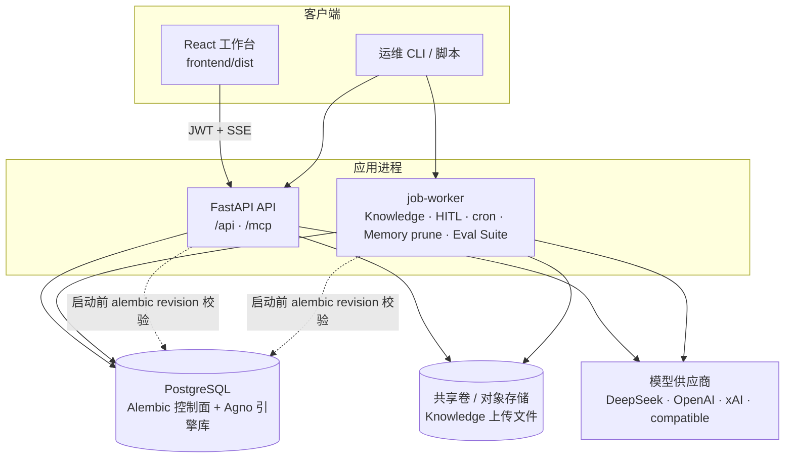

# 配置与运维

## 运行拓扑（概览）

控制面配置落在 PostgreSQL；API 与 Job Worker 共用库与（可选）共享卷；前端经 JWT 访问业务路由。



- 版本号以 `pyproject.toml` 的 `[project].version` 为唯一来源；API `app_version` / OpenAPI `version` 默认从已安装包元数据读取，可用 `APP_VERSION` 覆盖。发版时同步 `frontend/package.json` 的 `version`。
- 前端 i18n：侧栏语言按钮切换 `zh-CN`/`en-US`（`localStorage.locale`），页面/通知中心/Knowledge 入库文案走 feature 命名空间；日期与相对时间跟随当前语言。
- 环境变量：应用配置使用 `TAIS_*` / 领域名（`POSTGRES_*`、`AUTH_*`、`MCP_*`）；`AGNO_*` 仅用于引擎耦合（如 `AGNO_DB_SCHEMA`）。
- CVE 情报源配置为 `config/cve_sources.toml`（可用 `TAIS_CVE_SOURCE_CONFIG_PATH` 覆盖，相对路径相对仓库根解析）。IP 黑名单威胁情报源为 `config/ip_blacklist_sources.toml`（默认 FireHOL level1；`TAIS_IP_BLACKLIST_SOURCE_CONFIG_PATH` 可覆盖）；管理员可在「安全情报 → IP 黑名单」更新库，Chat 意图可挂载 `ip-blacklist-skill`。下载缓存仍落在 `.config/cve` / `.config/ip_blacklist`（运行时数据，不入 git）。
Collect 按 `api/utils/url2md_utils.domain_rules` 源站爬取文章入库（`collect_articles`），页面默认从库检索。标题优先 og:title；可选 `TAIS_COLLECT_USE_PLAYWRIGHT` 浏览器兜底。解析侧用 `resolve_domain_rule_key` 归一化 host/`www` 并安全匹配多 class 正文容器（div/article/section/main）；规则未命中、class 漂移或 domain 正文过短（<200）时回退语义容器（article/main 等）；正文抽取含 h1–h4/pre/blockquote；已停用 botcrawl / The Register / securitylab.ru；源站含 BleepingComputer/Krebs/SecurityWeek/Dark Reading/The Record/Unit 42/Cloudflare 等；文章卡可跳转 CVE。同步时并发发现与抓取；跨源 round-robin 选取 URL 并跳过已入库成功项后补齐预算；重复同步返回 409。列表默认不带正文、可筛失败并 reparse/批量重采；源健康计数与按失败源快捷筛选；同步可按当前筛选源站；发现阶段跟进分页列表页；CVE 关键词走全文索引，页面进入即检索最近条目；库更新与 Collect 源站同步均支持 `stream=true` 阶段进度；Collect 同步与 CVE 库更新均可前端 Abort 停止（发现/抓取 sibling 任务一并取消；已写入变更保留）。
- `POSTGRES_*` / `POSTGRES_URL`：PostgreSQL 连接。
- 控制面（认证、`app`、`mcp`）表结构仅由 Alembic 管理；发布阶段先执行 `uv run alembic upgrade head`，API 与 Worker 仅校验数据库 revision，未迁移时会拒绝启动。`20260720_0001` 是冻结的历史 schema 快照（不是运行时 metadata），后续表/字段均由各自 revision 创建，因此空数据库可完整升级；`0002` 仅为 xAI 配置数据规范化。Agno 自有的 session/trace/vector 表仍随已锁定的 Agno 版本管理。
- RBAC 升级演练必须在恢复出的 PostgreSQL 克隆库完成，不能对生产库使用脚本的 `--apply`。先为克隆建立并记录 `pg_dump` 备份，再运行只读预检：`uv run rehearse-rbac-migration`（默认读取应用的 PostgreSQL 配置；也可显式传入 `--database-url "$POSTGRES_URL"`）。确认报告中的历史角色、Eval snapshot、Knowledge job 数量及运行中任务数后，才在该克隆执行：`uv run rehearse-rbac-migration --database-url "$POSTGRES_URL" --apply --backup-reference "pg_dump:<artifact>" --confirm-clone I_UNDERSTAND_THIS_IS_A_CLONE`。该命令升级至当前 Alembic head，并验证账户 `admin`/`is_superuser` 一致性、`auth_version` 与 durable snapshot 归一化；保存 JSON 报告、备份引用、耗时和 worker 恢复结果后，才能安排生产发布。
- `ENVIRONMENT=production`（或 `prod`）启用 fail-closed 启动校验：`AUTH_JWT_SECRET`、重置/验证/OAuth state secret 必须替换默认或模板值，`CORS_ORIGINS` 与 `TRUSTED_HOSTS` 必须列出明确值而非 `*`；配置 OAuth 时还必须设置 `AUTH_COOKIE_SECURE=true`。
- `AUTH_JWT_SECRET`：JWT 密钥；生产环境必须替换默认值。
- `/api/health` 是不依赖下游服务的 liveness probe；`/api/ready` 在启动完成且控制面 PostgreSQL `SELECT 1` 成功后才返回 200，失败时返回 503。
- `TAIS_BOOTSTRAP_ADMIN_EMAIL`、`TAIS_BOOTSTRAP_ADMIN_PASSWORD`：可选的初始管理员。
- `TAIS_KNOWLEDGE_*`：Knowledge chunk、search、rerank 与 PgVector 配置。
- 知识库检索：`TAIS_KNOWLEDGE_SIMILARITY_THRESHOLD` 等 PgVector 参数可在 **Settings → 知识库检索** 表内调整（参数/说明/值）；低于阈值的片段丢弃并允许 0 结果。Chat 设置同样用带说明列的参数表。检索试验台与 Trace 展示每条 score；Agent 经 `knowledge_retriever` 共用过滤逻辑。
- 运行时知识检索配置落在 `app.knowledge_rag_settings`（`alembic upgrade head` 含 `20260720_0003`），API 为 `GET/PATCH /api/settings/knowledge`（admin）。
- Durable Jobs：Knowledge 入库、Workflow 审批恢复、安全 HITL 恢复、cron dispatch、**Memory prune** 与 **Eval Suite run** 均写入 PostgreSQL 队列，发布后另起 Worker：`uv run job-worker --concurrency 4`。Worker 与 API 一样会先校验 Alembic revision；cron 的 claim 与入队在同一事务内完成。当前 Knowledge 上传文件落在配置的本地目录，独立部署 API/Worker 时必须共享该持久卷（或在部署层替换为对象存储）。
- Eval Suite：`POST /api/agent-evals/suites/{id}/runs` 在**同一事务**内创建 `queued` SuiteRun、全部 `queued` CaseRun 工作项与 `eval_suite_run` durable job，并返回 `202`；job payload 只有 `suite_run_id`。私有 SuiteRun snapshot 只保存 actor capability 投影、selector、**case_count**、超时、judge 配置和 Suite 目标；每条 Case 定义与 provenance 只保存在自己的 CaseRun 工作项。不会在 HTTP 请求内等待模型调用，也不会因 API 进程在两次写入之间退出而留下无 job 或无工作项的 queued run。同一 Suite 同时只允许一个 queued/running/cancelling run。Worker 认领后从 snapshot 恢复 Suite 级上下文，再按冻结 `work_item_index` 读取既有 CaseRun；绝不读取当前用户权限或编辑中的 Suite/Case、更不会动态插入 CaseRun。每次 durable claim 都有单调递增的 lease epoch，SuiteRun、CaseRun claim、进度和终态写入都必须匹配 `(job_id, epoch)`，并在同一事务锁定 `durable_jobs`，验证 job 类型/载荷、`running` 状态、epoch 和未过期租约。因此新 epoch 即使尚未写入 SuiteRun，旧 worker 的 checkpoint、partial summary 和最终状态也会被数据库拒绝；每个预创建工作项带顺序索引，数据库保证同一 SuiteRun 内的顺序和 source Case 唯一，manifest 的 `case_count` 同时防止尾部工作项丢失，并以 CAS 保存私有 evaluator checkpoint（包括 `skipped`）。租约恢复会复用已提交 checkpoint 的判定、分数、时延、可靠性诊断和性能聚合；它不保存输入、completion 或 Judge 自由文本。已跨越 Agent/LLM/tool 调用边界但尚未提交 checkpoint 的请求仍是 at-least-once，目标如有外部副作用应支持稳定幂等键。运行中的 Suite 可调用 `POST /api/agent-evals/suite-runs/{run_id}/cancel`；它先显示 `cancelling`，worker 会取消当前 Case、将未启动 Case 标为 `skipped`，最终写为 `cancelled`。升级至此执行模型时，迁移会将没有 durable snapshot 的旧 `queued`/`running`/`cancelling` 记录标为 `error`；它们不能安全恢复，应重新提交 Suite。生产环境必须运行上述 Worker，且应监控没有可用 worker 时长期停留的 `queued` 记录。
- Workflow cron 轮询（对齐 Agno SchedulePoller 语义，进程内 ticker + durable dispatch）：`TAIS_WORKFLOW_CRON_ENABLED`（默认 true）、`TAIS_WORKFLOW_CRON_POLL_INTERVAL_SEC`（默认 15）、`TAIS_WORKFLOW_CRON_TICK_LIMIT`（每 tick 扫描上限，默认 200）、`TAIS_WORKFLOW_CRON_CATCHUP_MAX`（单工作流每 tick 最多补发 overdue 次数，默认 3）。启用 cron 时服务端校验 5 字段表达式；`last_run_at` 按 **scheduled** 时间推进以便 catch-up。
- 模型输入护栏（Agno `pre_hooks`，不含 OpenAI Moderation）：运行时优先读控制面表 `app.guardrail_settings`（Alembic `20260721_0006`），可用 **Settings → 模型护栏**（admin）热更新；环境变量 `TAIS_GUARDRAILS_*` 作缺省种子。Chat/Team leader/Workflow 步骤 Agent 共享同一套；SSE 失败码形如 `GUARDRAIL_PII_DETECTED` / `GUARDRAIL_PROMPT_INJECTION`（`retryable=false`）。API：`GET/PATCH /api/settings/guardrails`。
- Chat 运行参数（Alembic `20260721_0007`–`0011` 扩展 `chat_settings`）：
  - **Settings → Chat 设置**：展示/隐私、历史与摘要、工具上限（不含记忆）。
  - **Settings → 记忆**：`memory_mode`（`off` | `automatic` | `agentic` 单选）、`memory_tool_content_enabled`、注入筛选 `memory_inject_enabled` / `top_k` / `window_days` / `dedupe_topics`（**无字符预算**）、prune `memory_prune_*`。
  - Capture：全局只记偏好/职责/长期事实；`security-operations` SOC 白名单（禁记 IOE；运维事实走 Knowledge）。
  Chat/Team 使用廉价 `MemoryManager`；无真实 `user_id` 时 fail-closed。API 仍为 `GET/PATCH /api/settings/chat`（两页分表单提交不同字段子集）。
- Memory 自动 prune：JobKind `memory_prune`；API 启动时 `ensure_memory_prune_scheduled` 入队，Worker 执行后按 `interval_hours`（默认 24h）自调度下一次。需运行 `uv run job-worker`。
- 真实负载基准：`uv run benchmark-runtime --url https://staging.example --token "$TAIS_BENCHMARK_TOKEN" --model-id configured-model --requests 12 --concurrency 3 --scenario both --output .logs/benchmarks/runtime.json` 会以短期 Bearer token 对预发发送真实 Chat SSE / Dashboard Overview 请求，记录 TTFT、总时延、p50/p95、事件量和失败率；报告不写 token、prompt 或模型输出。附件路径通过 `--file` 可测端到端 Docling + Chat 路径；文档转换后的原始文件只用于 data-analysis / Team 的运行隔离工作区，不会作为模型的 `file` content part 发送。
- PgVector 索引核验：`uv run verify-pgvector-indexes` 只读检查实际 schema/table、embedding 维度、`pg_indexes` 定义、向量/全文 GIN/JSONB metadata GIN 索引，并输出 JSON 报告；不会调用 Agno `optimize()` 或创建索引。只有明确传入 `--explain-sql "SELECT ..."` 时才捕获非 `ANALYZE` 的 JSON plan。先用真实语料验证 corpus 规模、召回与延迟，再把批准的 HNSW/IVFFlat/GIN 变更写入 Alembic migration。
- MCP 服务配置以 Settings / PostgreSQL 为准；残留 `.config/mcp/mcp_config.json` 只会归档为 `.migrated`，不会再导入。
- `VITE_API_PROXY_TARGET`：前端开发代理地址，默认 `http://127.0.0.1:8001`，与本项目的 Uvicorn 本地启动命令一致。生产环境应把 `frontend/dist` 交给具备 immutable cache + Brotli/gzip 的反向代理或 CDN；直接由 FastAPI StaticFiles 托管的开发路径不负责资源压缩。
- Dashboard 的趋势与分布图表使用 `echarts/core` 按需注册（line / bar / pie），且只在 Overview 返回可视化数据时动态加载；空窗口显示统一的运行可视化空态，不请求 ECharts 图表 chunk。

## 模型运行策略

设置页只编辑连接信息（名称、供应商、Model ID、密钥、Base URL、启用）。新建模型或切换供应商时，前端只提交这些字段；后端 `model_capabilities` 统一补齐协议、structured output、reasoning、重试、并行工具调用和 Live Search 的最优/兜底值。同一供应商的既有运行参数保持不变，避免无关编辑改写已验证的运行配置。

模型连接可指定 **MemoryManager** 模型（`memory_model_id` / 行级 `memory_manager` 标记，Alembic `20260721_0012`）：用于记忆抽取的廉价模型；未指定时自动挑选 flash/mini 等。Chat 默认模型仍为 `active_model_id`。

模型工厂仍支持已持久化的 `parallel_tool_calls`、`retries` / `delay_between_retries` / `exponential_backoff` 与可选 `http_max_retries`；默认使用 4 次指数退避。Responses 与 Chat Completions 共享同一模型工厂，因此策略在聊天 Run 与会话摘要路径一致生效。

模型供应商支持 DeepSeek / OpenAI / **xAI（Agno 官方 `xAI` 类，Chat Completions）** / OpenAI-compatible。 xAI 可配置 structured output 与 Live Search；Chat 输入区可开关联网搜索与知识库检索。 附件区使用 `@ant-design/x` `Attachments`：纸夹首次仅展开附件区，点击占位添加框才打开系统选择器（支持多选），并提供拖放、数量提示与体积限制。 **Chat 文档附件经 Agno DoclingReader 转为 Markdown 注入消息**；原始文档只 stage 到 data-analysis / Team 的每运行隔离目录，绝不同时作为 Agno `files` 传给 Chat Completions 模型（图片/音视频仍走 Agno media）； **Knowledge 结构化文档（PDF/DOCX/PPTX/HTML 等）默认 `DoclingReader`**。 设置页模型表单仅配置连接信息（名称/供应商/Model ID/密钥/Base URL）；其余模型参数由能力画像解析（optimal → 配置 → 请求覆盖 → fallback）；xAI 不使用 `reasoning_effort`，靠推理/非推理 model id。历史 Grok 配置（`api.x.ai` 或 `model_id` 以 `grok` 开头）由 `uv run alembic upgrade head` 中的数据迁移规范写回为 `provider=xai`、Chat Completions；运行时加载不再执行逐行兼容写回。残留 `config/model_config.json` 一律归档为 `*.imported` 且**永不导入**（无 `TAIS_MODEL_CONFIG_FILE` 覆盖）；空表只 seed 内置默认模型，连接与密钥以 Settings/Postgres 为准。

模型工厂把 structured output 模式存在实例私有属性 `_tais_structured_output_mode`，**不写** Agno `model.metadata`，避免 OpenAI Responses / Chat 把内部标记当作 HTTP `metadata` 发给 Grok 等不兼容网关（会 400 `Argument not supported: metadata`）。

前端生产构建：

```bash
cd frontend && bun run build
```

构建结果由 FastAPI 静态托管，且不依赖 AgentOS。运行时配置、CVE 缓存和上传文件默认位于 `.config/`，日志位于 `.logs/`，均不纳入 Git。更新 CVE 数据：

```bash
uv run update-cve
```

部署时还应配置生产级数据库、JWT 密钥、MCP token、模型配置和 CORS。
