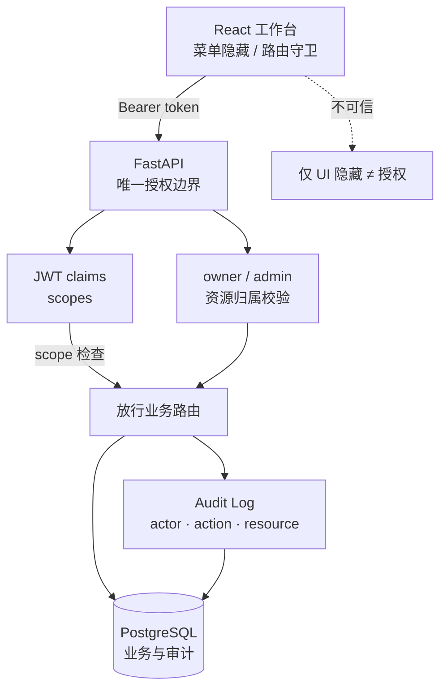

# 安全与审计

后端是唯一安全边界：前端的菜单隐藏、按钮禁用和路由保护只改善体验，不能作为授权依据。系统只保留 `admin` 与 `user` 两类产品角色；所有受保护 API 必须在后端检查 scope，用户资源必须校验 owner 或 admin 能力。普通用户可使用日常工作台能力，但只能管理自己的 private 资源；管理员保留系统级控制。

登录使用 FastAPI Users/JWT，scope 写入 JWT claims。每个用户还带有单调递增的 `auth_version`：角色变更、管理员状态变更或密码修改会推进该版本，旧 JWT 会在下一次请求被拒绝，而不是等待 TTL 到期。管理员不能修改自己的访问级别，系统也不允许降级最后一名活跃管理员；角色变更会记录 `auth.role_update` 审计事件。关键变更会记录 actor、action、resource、metadata、IP 和 user-agent。管理员可通过 `GET /api/audit/logs`（需要 `audit:read`）按用户、动作、资源、状态、IP 和时间范围分页查询审计事件，响应为 Agno 风格 `{data, meta}`；普通用户只能处理自己的 HITL 审批，Skill/MCP 提交仍由管理员审批；当前不提供导出、实时告警或外部 SIEM 集成。

模型输入护栏（PII / Prompt Injection）见 [配置与运维](./operations.md)。**安全防护能力回归**（公开/自建数据集、ASR/拒答指标、与 Agent Evals 的映射）见 [安全防护评估设计](./safety-eval.md)。

## 授权与审计边界

