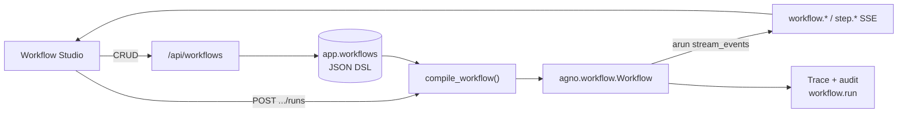

# 工作流编排技术架构

> 状态：**PR1 已落地**（线性 Step 定义 CRUD + 编译 + SSE 运行）。并行 / 条件 / 循环 / 画布为后续阶段。

## 目标与原则

工作台 Workflow 不是独立调度引擎，而是把 **可持久化 DSL → Agno `Workflow` 编译 → 流式运行 → Trace / 审计** 串成闭环：

| 原则 | 说明 |
|------|------|
| 状态源 | Agno `Workflow` / `WorkflowSession` / Run 事件 |
| 工作台职责 | 定义 CRUD、校验、编译、SSE 投影、权限与审计 |
| 不做 | 全量挂载 AgentOS、前端 `eval` 用户代码、自研执行引擎 |
| 与 Chat 关系 | 共享模型工厂；PR1 步骤 **无 MCP 工具**，降低编排不确定性 |

## 端到端数据流

工作台把 **可持久化 DSL → 编译 → 流式运行 → Trace / 审计** 串成闭环：



## PR1 契约（当前实现）

**定义 DSL（仅线性 `step`）**

```json
{
  "name": "Incident triage",
  "description": "...",
  "steps": [
    {
      "id": "triage",
      "type": "step",
      "name": "Triage",
      "executor": { "kind": "agent", "ref": "security-operations" },
      "instructions": "Classify severity"
    }
  ]
}
```

- `executor.ref` 必须来自内置目录：`security-operations`、`safe-fallback`（`GET /api/workflows/executors`）。
- 持久化 DSL 使用 `executor.ref`、Condition `steps` / `else`、Loop `max_iterations` / `end_condition`、`workflow_ref.workflow_id`；启动时会幂等迁移旧定义与版本快照，写入接口不再接受旧别名。
- PR4 支持嵌套 `step` / `parallel` / `condition` / `loop` / `router` / `workflow_ref`。
- 约束：最大深度 5、总节点 ≤40、叶子 Agent 步 ≤20；Parallel 至少 2 分支；Condition/Loop 使用 CEL（`cel-python`）。
- 编译期拒绝 HITL 字段与 Parallel 内 executor HITL（与 Agno 一致）。

**HTTP**

| 方法 | 路径 | Scope | 说明 |
|------|------|-------|------|
| GET | `/api/workflows` | `workflows:read` | `{data,meta}` 列表 |
| POST | `/api/workflows` | `workflows:write` | 创建 |
| GET/PATCH/DELETE | `/api/workflows/{id}` | read / write | 详情、更新、删除（owner 隔离，admin 可跨用户） |
| GET | `/api/workflows/executors` | `workflows:read` | 可绑执行器目录 |
| GET | `/api/workflows/templates` | `workflows:read` | 内置安全模板 |
| GET | `/api/workflows/node-presets` | `workflows:read` | 业务预设 + 当前用户自定义节点 |
| POST/PUT/DELETE | `/api/workflows/custom-nodes[/{id}]` | `workflows:write` | 用户自定义 step 预设 CRUD |
| POST | `/api/workflows/{id}/runs` | `workflows:run` | SSE 运行（body 可选 `run_id` 预分配） |
| POST | `/api/workflows/runs/{run_id}/cancel` | `workflows:run` | 取消 live Studio 运行 |

**SSE 事件（工作台投影）**

| Event | 含义 |
|-------|------|
| `workflow.started` | 运行开始（含 `run_id` / `session_id` / skills；单次） |
| `step.started` / `step.completed` / `step.error` | 叶子步骤生命周期；`content` 为预览截断 |
| `parallel.started` / `parallel.completed` | 并行块生命周期（含 `parallel_step_count`） |
| `condition.started` / `condition.completed` | 条件块（含 `condition_result` / `branch`） |
| `loop.started` / `loop.completed` | 循环块（含 `max_iterations` / `total_iterations`） |
| `loop.iteration.started` / `loop.iteration.completed` | 循环迭代（含 `iteration` / `should_continue`） |
| `router.started` / `router.completed` | Router 选择分支 |
| `workflow.completed` / `workflow.failed` / `workflow.cancelled` | 终态 |
| `workflow.paused` | Step 确认暂停；携带 `approval_id`，在 Approvals 批准/拒绝后 `acontinue_run` |

**关键代码**

```text
api/persistence/workflows.py          # app.workflows 表
api/services/workflow_compiler.py     # DSL 校验 + Agno Step/Parallel/Condition/Loop 编译
api/services/workflow_service.py      # CRUD / 权限投影
api/services/workflow_run_runtime.py  # arun 流 → SSE
api/routes/workflows.py               # HTTP + EventSourceResponse
frontend/src/features/workflow/*      # 工作流画布（draw.io 风格网格/状态条/分组工具栏；reparent / 快捷键 / auto-layout / Inspector / SSE）
```

## 路线图（PR2+）

| 阶段 | 能力 | 说明 |
|------|------|------|
| **PR1** ✅ | 线性 Step + Save/Run SSE | 本版 |
| **PR2** ✅ | `Parallel` / `Condition(CEL)` / `Loop` | 表单级嵌套控制流；CEL 依赖 `cel-python`；编译期禁止 Parallel 内 HITL |
| **PR3** ✅ | 画布 + Step HITL | React Flow 只读布局选中；Step `requires_confirmation` → Approvals；`workflows:read/write` |
| **P0 产品** | P0.1–P0.4 ✅ 黄金路径闭环（见 TODOs） |
| **Perf** ✅ | Studio SSE 增量 runStatus + 选中/高亮 patch + runLog 上限 |
| **Layout** ✅ | `applyAutoLayout` 像素级树打包，防 then/else 节点重叠 |
| **RF skill** ✅ | typed nodes / stable props / onlyRenderVisible / isValidConnection |
| **P0 UI** ✅ | Studio：`updateNodeData` 运行态 + antd-in-canvas（nodrag/popup） |
| **PR9** ✅ | 安全模板库 / `workflows:run` / Inspector CEL 自动完成 |
| **P0.1** ✅ | Studio 状态机：draft/published 顶栏、触发器发布守卫、空态模板 CTA |
| **P0.2** ✅ | 触发器运维：Webhook URL/curl、Cron last/next、失败通知 |
| **PR8c** ✅ | 触发器生产化：cron 原子占坑 / webhook·cron 审计 / Studio 触发历史 |
| **PR8d** ✅ | 画布性能：runStatus data patch；Inspector undo burst |
| **PR8b** ✅ | 画布打磨：保存校验 / 连线高亮 / run 聚焦 / NodeToolbar |
| **PR8a** ✅ | 多 Handle 分支边（Condition then/else · Router choices） |
| **Ports** ✅ | 几何感知 L/R vs top/bottom（`pickConnectionHandles`） |
| **Align** ✅ | 拖拽智能对齐辅助线；Chat 操作位右下角 |
| **PR7** ✅ | Publish + Cron 真调度（published 修订 / webhook·cron 只用线上版） |
| **PR6** ✅ | 画布 run 状态 / Run 历史 / Approvals↔Studio 深链 / user_input_schema 表单 |
| **PR5** ✅ | 画布 reparent / undo·redo·多选 / auto-layout / Approvals user_input·output_review 表单 |
| **Paste** ✅ | 粘贴进选中容器默认槽 / 同级插入；Parallel 内 HITL 粘贴回退根级 + 客户端校验与 Inspector 禁用 |
| **PR4** ✅ | Router / 嵌套 Workflow / 版本 / 触发器 + 画布编辑 + 完整 Step HITL | 见下 |

**PR2 嵌套 DSL 示例**

```json
{
  "name": "IR nested",
  "steps": [
    {
      "id": "fanout",
      "type": "parallel",
      "name": "Fan-out",
      "steps": [
        { "id": "cve", "type": "step", "name": "CVE", "executor": { "kind": "agent", "ref": "security-operations" } },
        { "id": "asset", "type": "step", "name": "Asset", "executor": { "kind": "agent", "ref": "safe-fallback" } }
      ]
    },
    {
      "id": "branch",
      "type": "condition",
      "name": "Severity",
      "evaluator": { "cel": "input.contains(\"critical\")" },
      "then": [
        { "id": "contain", "type": "step", "name": "Contain", "executor": { "kind": "agent", "ref": "security-operations" } }
      ],
      "else": [
        { "id": "report", "type": "step", "name": "Report", "executor": { "kind": "agent", "ref": "safe-fallback" } }
      ]
    },
    {
      "id": "retry",
      "type": "loop",
      "name": "Retry",
      "max_iterations": 3,
      "end_condition": { "cel": "last_step_content.contains(\"DONE\")" },
      "steps": [
        { "id": "probe", "type": "step", "name": "Probe", "executor": { "kind": "agent", "ref": "safe-fallback" } }
      ]
    }
  ]
}
```

后端编译为 Agno `Step` / `Parallel` / `Condition` / `Loop`；前端为表单级嵌套编辑（非画布）。

## 设计决策（已拍板 / 默认）

1. **Executor 来源（PR1）**：内置 Agent 注册表，不手填任意 Python。  
2. **MCP/Skills**：步骤默认无 MCP 工具；**P0.3** Step 可绑定已启用 Skill（`skills[]` = 启用 ∩ 绑定；未绑定则不挂）。  
3. **画布（PR1–PR2）**：不做；列表 + 嵌套 Inspector；React Flow 在 PR3。  
4. **Session**：每次 Run 新 `session_id`，与 Chat session 隔离；UI 可跳转 Trace。  
5. **权限（PR3/PR9）**：`workflows:read` / `write` / `run`；菜单用 read；Run 用 run；编辑用 write。

## 明确不做

- 继续只生成不可执行伪代码当作「编排完成」  
- 前端直接执行用户代码  
- 绕过 Agno 自研 step runner  
- 首期并行 + 深度嵌套 + 画布一把做完  


